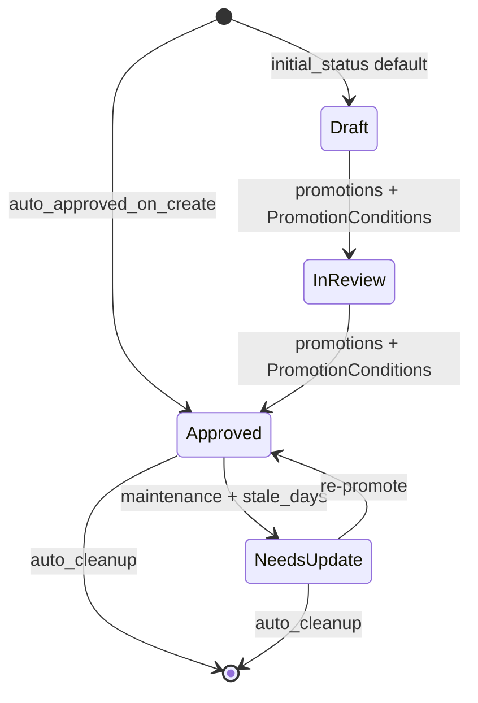

## 背景与设计裁决

基于对 [crates/wiki-core/src/schema.rs](crates/wiki-core/src/schema.rs)、[crates/wiki-cli/src/main.rs](crates/wiki-cli/src/main.rs)、[crates/wiki-cli/src/mcp.rs](crates/wiki-cli/src/mcp.rs)、[crates/wiki-core/src/model.rs](crates/wiki-core/src/model.rs)、[crates/wiki-core/src/page.rs](crates/wiki-core/src/page.rs) 的阅读，确定以下设计约定，作为后续所有实现的前置：

- `EntryStatus` 仅挂在 **`WikiPage`** 上；`Claim` 维持 `MemoryTier` + `stale: bool` 的既有模型不动，避免两个生命周期维度互相覆盖。
- `LifecycleRule.stale_days` 语义：`auto_cleanup = false` 时 → 标记 `status = NeedsUpdate`；`auto_cleanup = true` 时（如 LintReport）→ 直接从 store 删除。
- 现有 `Cmd::Promote { claim_id }` 是 **claim tier 晋升**，不破坏；T1 新增独立的 `Cmd::PromotePage { page_id, ... }`，两条生命周期并存。
- 模型向前兼容全靠 `#[serde(default)]`，不写数据迁移命令。

EntryStatus 的 4 态与 `LifecycleRule` 字段对照：

---

## Phase 0 — 落档整体路线图（最前置）

- 新建 [docs/schema-followup-plan.md](docs/schema-followup-plan.md)，包含：
  - T0 / T1 / T2 / T3 四层分级与依赖关系（mermaid）。
  - 每一项的 schema 入口字段、实现挂点、前置条件、完成判据。
  - 明确 "当前实施 T0 + T1 全闭环；T2 tag 治理等补数据模型后启动；T3 延后"。
- 这是只读文档，不影响代码路径，先落盘方便后续 PR 引用。

---

## Phase T0 — 两项小改动

### T0.1 `wiki schema validate` 子命令

- [crates/wiki-cli/src/main.rs](crates/wiki-cli/src/main.rs) `enum Cmd` 增加 `SchemaValidate { path: PathBuf }`（或 `path: Option<PathBuf>`，默认 `DomainSchema.json`）。
- 调用 `DomainSchema::from_json_path(&path)`，成功打印 `schema ok: title=… lifecycle_rules=N`；失败打印 `SchemaLoadError` 并 `exit(1)`。
- **测试轮 1**：`cargo test -p wiki-cli schema_validate`
  - valid json 用例（fixtures/valid_schema.json）→ exit 0
  - 重复 EntryType / 自环 / 环路 三种无效 schema → exit 非 0，stderr 含关键字

### T0.2 `--entry-type` 扩档到 Crystallize 链路

- [crates/wiki-cli/src/main.rs](crates/wiki-cli/src/main.rs) `Cmd::Crystallize` 加 `#[arg(long)] entry_type: Option<String>`，在 `:363` WikiPage 创建处走 `parse_entry_type_opt` 套 `with_entry_type`。
- [crates/wiki-cli/src/mcp.rs](crates/wiki-cli/src/mcp.rs) `wiki_crystallize` 工具 JSON schema 加 `entry_type` 可选字段；`:412` 创建页时同上应用。
- **测试轮 2**：`cargo test -p wiki-cli`（含旧 entry_type_flag 测试）
  - 新增 crystallize with entry_type=entity → page.entry_type 正确 + lint 产生 incomplete 项
  - 无 entry_type → 行为回归
- **测试轮 3**：`cargo test --workspace && cargo fmt --all -- --check && scripts/e2e.sh`

T0.3：commit + push，CI 全绿后进入 T1。

---

## Phase T1 — Lifecycle 主线全闭环

### T1.A WikiPage.status 数据模型

- [crates/wiki-core/src/page.rs](crates/wiki-core/src/page.rs) 新增 `#[serde(default = "default_status")] pub status: EntryStatus`，默认 Draft。
- 新增 `WikiPage::with_status(self, EntryStatus) -> Self`。
- **测试轮 4**：`cargo test -p wiki-core page_status`
  - 旧 json 无 status 字段 → 反序列化得 Draft
  - 新建 page 默认 Draft
  - `with_status` 链式设置生效

### T1.B 创建时的 initial_status 解析

- [crates/wiki-kernel/src/engine.rs](crates/wiki-kernel/src/engine.rs) 加 `pub fn initial_status_for(entry_type: Option<&EntryType>, schema: &DomainSchema) -> EntryStatus`：
  - `entry_type.auto_approved_on_create()` → Approved
  - `schema.find_lifecycle_rule(et)` 命中 → `rule.initial_status`
  - 其它 → Draft
- 让 [main.rs](crates/wiki-cli/src/main.rs) `IngestLlm` / `Query` / `Crystallize` 三处 `WikiPage::new(...).with_entry_type(et).with_status(initial_status_for(et, schema))`。
- [crates/wiki-cli/src/mcp.rs](crates/wiki-cli/src/mcp.rs) `wiki_crystallize` 同步补。
- **测试轮 5**：`cargo test -p wiki-kernel initial_status`
  - entry_type=Summary → Approved（不过 rule 也过）
  - entry_type=Concept + schema 有 rule initial=Draft → Draft
  - entry_type=None → Draft

### T1.C Promote Page 闭环（PromotionConditions 全字段）

- [crates/wiki-cli/src/main.rs](crates/wiki-cli/src/main.rs) 新增 `Cmd::PromotePage { page_id, to: Option<String>, force: bool }`；`to` 为空时按 rule 取 Draft 下一跳。
- [crates/wiki-kernel/src/engine.rs](crates/wiki-kernel/src/engine.rs) 新增：
  - `pub enum PromotePageError { UnknownPage, NoEntryType, NoRule, NoPromotion, AgeTooYoung{need, have}, MissingSections(Vec<String>), NotEnoughReferences{need, have}, Cooldown{need, have} }`
  - `pub fn promote_page(&mut self, page_id, to_status, actor, now) -> Result<(), PromotePageError>`：
    - 查 page → entry_type → `find_lifecycle_rule`
    - 匹配 `PromotionRule { from_status == page.status, to_status == to }`
    - 逐项检查 `min_age_days`（基于 page.updated_at 或 created_at）、`required_sections`（复用现有 lint section 抽取）、`min_references`（统计 summary → page 的 mention 边）、`cooldown_days`
    - 通过 → 写 `page.status = to`，`page.updated_at = now`，发 `WikiEvent::PageStatusChanged`（如尚未有该事件则同批添加）
- **测试轮 6**：`cargo test -p wiki-kernel promote_page`
  - 4 条 PromotionConditions 每条一个失败用例
  - 满足全部条件 → 晋升成功
  - `--force` 跳过条件
- **测试轮 7**：`cargo test -p wiki-cli promote_page`
  - CLI 成功/失败路径各一，错误消息含中文关键字

### T1.D Maintenance 消费 `stale_days`（非 auto_cleanup 分支）

- [crates/wiki-kernel/src/engine.rs](crates/wiki-kernel/src/engine.rs) 新增 `mark_stale_pages(&mut self, now, schema) -> u32`：
  - 遍历 schema.lifecycle_rules 中 `stale_days = Some(d) && auto_cleanup == false` 的 entry_type
  - 对每个 page 若 `page.entry_type ∈ types && status != NeedsUpdate && now - page.updated_at > d 天` → 置 `status = NeedsUpdate`，发事件
- [main.rs](crates/wiki-cli/src/main.rs) `Cmd::Maintenance` 调用它并把计数打进输出 `pages_marked_needs_update=N`。
- **测试轮 8**：`cargo test -p wiki-kernel mark_stale`
  - 过期 Concept → NeedsUpdate
  - 未过期 → 不动
  - 已经是 NeedsUpdate → 不重复触发事件
  - 无 stale_days → noop

### T1.E Maintenance 消费 `auto_cleanup`

- `cleanup_expired_pages(&mut self, now, schema) -> u32`：
  - 对 `stale_days = Some(d) && auto_cleanup == true` 的 entry_type
  - 超过 d 天未更新 → 从 `store.pages` 移除，发 `WikiEvent::PageDeleted`（复用已有事件类型，没有就同批加）
- Maintenance 调用，输出 `pages_auto_cleaned=N`。
- **测试轮 9**：`cargo test -p wiki-kernel auto_cleanup`
  - LintReport + stale_days 过期 → 被清理
  - auto_cleanup=false 的不被清理
  - 过期但时间未到 → 不动

### T1.F 端到端 + 清仓

- **测试轮 10**：`cargo test --workspace && cargo fmt --all -- --check`
- **测试轮 11**：`scripts/e2e.sh`（全路径通）
- 更新 [Progress.md](Progress.md)：T0 / T1 全量记录（功能、踩坑、修复）。
- 更新 [docs/schema-followup-plan.md](docs/schema-followup-plan.md)：把已完成项打勾。
- commit + push；CI 观察全绿。

---

## 不在本次计划内（明确推后）

- Claim / LlmIngestPlanV1 / Source 的 `tags: Vec<String>` 字段（T2 tag 治理前置，单独规划）。
- `deprecated_tags` / `max_new_tags_per_ingest` / `allow_auto_extend` 三条 TagConfig 规则（T2 主线）。
- `orphan_threshold` / `dormant_threshold` 标签活跃度运营能力（T3，需数据积累）。