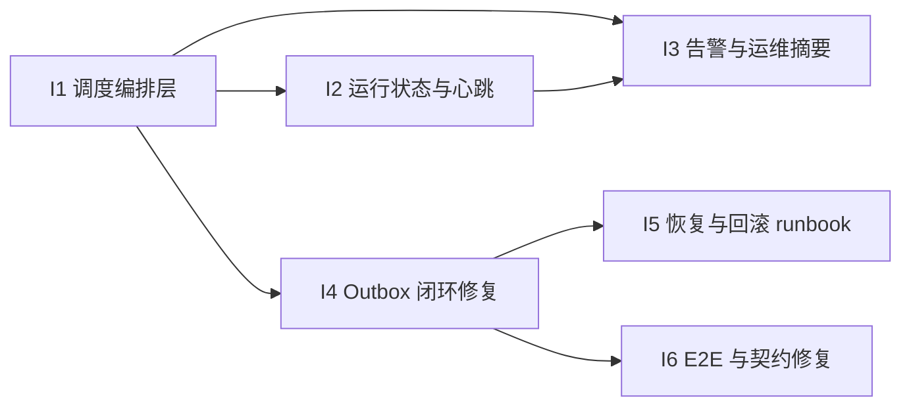

# Archived: wiki-mempalace 第一批 Issue / Task List 模板

> Archived document. 本批次已完成；当前计划见 [../roadmap.md](../roadmap.md)。本文只保留历史执行上下文，不再作为当前事实源。

本文档基于 [automation-implementation-plan.md](automation-implementation-plan.md) 拆出第一批适合并行启动的开发任务。

目标：

- 先完成 P0 的主链路基础设施
- 同时清理会阻塞自动化闭环的高优先级缺陷
- 每个任务都要求“实现 + 测试 + 检查 + 验收”，不接受只交代码不交验证

建议把这一批作为 **Sprint 1 / Wave 1**。

## 执行状态（已回填）

本批次已在当前分支完成，实际交付与原始计划的对应关系如下：

| Issue | 状态 | 实际交付 |
| --- | --- | --- |
| I1 | 已完成 | `automation run-daily`、固定 job plan、dry-run、失败即停、CLI 测试 |
| I2 | 已完成 | `wiki_automation_run` 状态表、运行状态 API、CLI 接线 |
| I3 | 已完成 | `automation status`、`automation doctor`、outbox/backlog 摘要 |
| I4 | 已完成 | claim replay / scope filter 以当前代码为准，补齐 consumer progress、增量消费起点、自动 ack、健康检查 |
| I5 | 已完成 | `recovery-runbook.md`、`recovery-drill.sh` |
| I6 | 已完成 | 前面已修的契约问题已确认；本批次额外回填了架构/bridge 文档漂移 |

实际变更文件：

- `crates/wiki-cli/src/main.rs`
- `crates/wiki-cli/tests/automation_run_daily.rs`
- `crates/wiki-storage/Cargo.toml`
- `crates/wiki-storage/src/lib.rs`
- `docs/recovery-runbook.md`
- `scripts/recovery-drill.sh`
- `docs/architecture.md`
- `docs/mempalace-linkage.md`

本批次的实际验证：

- `cargo test -p wiki-cli --quiet`
- `cargo test -p wiki-storage --quiet`
- `cargo test -p wiki-mempalace-bridge --quiet`
- `cargo test -p wiki-kernel promote_page --quiet`
- `cargo test -p rust-mempalace --test e2e_core --quiet`
- `bash -n scripts/recovery-drill.sh`

与原顺序相比的执行偏差：

- `I5` 实际上早于 `I4` 完整闭环落地，但现在已补齐 `I4`，所以批次已收口。
- `I3` 先做成最小可用版本，随后在同一批次内补成了带 outbox / consumer 健康信息的摘要出口。

---

## 使用方式

- 每个 Issue 可直接分配给一个 Agent 或一个工程师
- 若使用多 Agent 并行，优先按“建议 owner 范围”分配，减少文件冲突
- 每个 Issue 完成后，先在本 Issue 内完成测试与验收，再进入合并
- 不要把多个 Issue 的测试拖到最后统一执行

---

## Wave 1 总览



建议并行方式：

- Agent 1：I1
- Agent 2：I2
- Agent 3：I4
- Agent 4：I6
- I3 在 I1/I2 基本落地后接入
- I5 在 I4 的真实链路稳定后补齐

---

## I1. 统一调度编排层

### 标题

`P0 / M1: 建立统一自动化调度入口`

### 背景

当前系统已有多个独立命令：`batch-ingest`、`lint`、`maintenance`、`consume-to-mempalace`、`llm-smoke`。  
但它们仍偏手工调用，不利于形成稳定自动化流水线。

### 目标

建立统一任务调度入口，把日常自动化链路变成一个可重复执行、可 dry-run、可观察的流程。

### 范围

- 设计 job 定义模型
- 建立统一入口，例如：
  - `wiki-cli automation run <job>`
  - 或 `wiki-cli scheduler run-daily`
- 支持串行执行、失败即停、dry-run
- 输出清晰执行日志

### 建议 owner 范围

- `crates/wiki-cli/`
- 如需要可新增 `crates/wiki-kernel` 中极薄的 orchestration 支持

### 交付物

- 调度入口命令
- 任务执行顺序定义
- dry-run 输出
- 开发说明文档或命令帮助

### 实施步骤

1. 明确首批内置 job 集合
2. 定义 job 输入/输出/失败语义
3. 实现调度入口
4. 实现串行执行和失败短路
5. 实现 dry-run
6. 输出结构化日志

### 测试

- 单元测试：
  - job 顺序正确
  - 失败时后续 job 不执行
  - dry-run 不触发真实子命令
- 集成测试：
  - fake job 链路能完整跑通
  - 一个 job 故障时返回码正确
- 手工检查：
  - 输出日志包含开始、结束、状态、耗时

### 验收标准

- 一条命令能跑完整自动化日常链路
- 执行顺序稳定可预测
- 失败时立即终止并返回非零状态

### 风险

- 把原有 CLI 子命令耦合得太紧

### 回滚

- 保留原有子命令，调度层只做薄封装

---

## I2. 运行状态与心跳

### 标题

`P0 / M2: 为自动化任务补齐运行状态、心跳和最近成功记录`

### 背景

没有结构化运行状态，就无法判断：

- 任务有没有跑
- 最近一次成功是什么时候
- 是哪一步失败
- 故障是否已经持续多轮

### 目标

把自动化任务状态写成可查询、可汇总的结构化记录。

### 范围

- 设计运行状态存储
- 记录成功/失败/开始/结束/耗时/错误摘要
- 提供最近成功时间与最近失败时间查询
- 为调度层提供心跳写入

### 建议 owner 范围

- `crates/wiki-storage/`
- `crates/wiki-cli/`

### 交付物

- 新状态表或状态文件结构
- 状态写入逻辑
- 状态查询命令
- 最近成功/失败摘要输出

### 实施步骤

1. 设计状态模型
2. 设计持久化位置
3. 在调度入口接入状态写入
4. 增加读取与汇总命令
5. 输出最小健康摘要

### 测试

- 单元测试：
  - 成功记录写入正确
  - 失败记录写入正确
  - duration 计算正确
- 集成测试：
  - 连续两次运行能正确覆盖“最近一次成功”
  - 失败后能保留 error summary
- 手工检查：
  - 命令行能看见最近成功时间、最近失败时间、当前状态

### 验收标准

- 任意自动化任务完成后，都有结构化运行记录
- 运维人员无需翻日志也能知道最近状态

### 风险

- 状态模型设计过重，影响实现节奏

### 回滚

- 先上最小字段集合，不一次性做复杂历史分析

---

## I3. 告警与运维摘要出口

### 标题

`P0 / M3: 增加自动化失败告警与最小运维摘要`

### 背景

仅有状态记录还不够。自动化系统需要在异常时快速暴露问题。

### 目标

提供一个最小可用的运维出口，让操作者能快速看到：

- 哪个 job 失败
- 最近失败是否未恢复
- outbox 是否堆积
- mempalace 消费是否中断

### 范围

- 增加摘要命令，例如：
  - `wiki-cli automation status`
  - `wiki-cli automation doctor`
- 支持最小告警出口
- 先不强依赖第三方通知服务，可先落本地可读摘要

### 建议 owner 范围

- `crates/wiki-cli/`
- `scripts/`

### 交付物

- 状态摘要命令
- 异常判定规则
- 可选告警脚本骨架

### 实施步骤

1. 设计异常规则
2. 实现状态摘要视图
3. 接入 M2 状态数据
4. 接入 outbox 堆积检查
5. 接入 mempalace 消费健康检查

### 测试

- 单元测试：
  - 失败状态被正确标红
  - 连续失败能被识别
- 集成测试：
  - 构造 outbox backlog
  - 构造消费中断场景
- 手工检查：
  - 摘要结果一屏能读完

### 验收标准

- 能快速判断当前自动化系统是否健康
- 失败信息不需要翻大量日志才能定位

---

## I4. Outbox 闭环修复与消费健康增强

### 标题

`P0 / M4: 修复 outbox -> mempalace 主链路并补齐消费健康检查`

### 背景

这是当前自动化主链路里最关键的部分。  
如果 outbox 回放不完整或作用域隔离不正确，`palace.db` 就不能作为可靠的第二记忆层。

### 目标

确保 `wiki.db -> outbox -> bridge -> palace.db` 链路在真实代码中完整、可验证、可监控。

### 范围

- 修复 claim upsert 回放
- 修复 scope filter 在 outbox 消费中的实际生效
- 增加消费健康检查
- 增加最小端到端测试

### 建议 owner 范围

- `crates/wiki-core/`
- `crates/wiki-mempalace-bridge/`
- `crates/wiki-cli/`

### 交付物

- 完整 claim 回放逻辑
- scope 解析/过滤逻辑
- outbox 消费健康检查命令或状态字段
- 端到端测试

### 子任务拆分

#### I4-1. claim upsert 回放修复

- 让 `ClaimUpserted` 在消费时能够拿到完整 claim，而不是只有 `claim_id`
- 保证 live sink 真正写入 drawer/vector

测试：

- 单元测试：单个 claim upsert 事件能创建对应 drawer/vector
- 集成测试：`ingest -> export/consume -> mempalace query` 可见内容

#### I4-2. scope filter 真正落地

- 让 outbox 消费阶段能够解析 scope
- 在 replay 时应用 `scope_filter`

测试：

- 构造 `private:a` 与 `shared:team` 混合事件
- 验证不同 filter 下只消费目标 scope

#### I4-3. 消费健康检查

- 增加“最近消费到哪个 outbox id”“当前 backlog 多大”
- 暴露给 I3 的状态摘要

测试：

- 构造未消费积压
- 验证摘要可识别 backlog

### 验收标准

- claim 内容不再丢失
- scope 隔离真实生效
- 消费状态可观察

### 风险

- 事件模型变更会影响已有测试和桥接接口

### 回滚

- 分步落地：先修 replay，再补健康检查

---

## I5. 恢复与回滚 runbook

### 标题

`P0 / M5: 建立 wiki.db / palace.db / vault 的恢复与回滚流程`

### 背景

自动化系统迟早会遇到误写入、异常中断、部分同步失败。  
如果没有恢复流程，自动化越强，事故代价越高。

### 目标

把备份、恢复、重建、演练变成标准操作，而不是临场猜。

### 范围

- 明确 `wiki.db` 备份
- 明确 `palace.db` 备份或重建策略
- 明确 vault 文件恢复策略
- 编写 runbook
- 增加最小演练脚本

### 建议 owner 范围

- `scripts/`
- `docs/`

### 交付物

- 备份策略文档
- 恢复步骤文档
- 演练脚本或恢复检查脚本

### 实施步骤

1. 梳理现有 `backup.sh`
2. 明确全量/增量策略
3. 写恢复 runbook
4. 增加演练步骤
5. 验证重建 mempalace 是否可行

### 测试

- 手工演练：
  - 从备份恢复 `wiki.db`
  - 重建 `palace.db`
  - 校验 Markdown 投影一致性
- 检查：
  - runbook 可由陌生操作者复现

### 验收标准

- 有明确的一页式恢复步骤
- 至少完成一次真实演练并记录结果

---

## I6. E2E 与契约修复包

### 标题

`P0 / 横切: 修复已知契约漂移与假绿测试`

### 背景

在推进自动化之前，需要先消除几类会误导开发和 CI 的问题。

### 目标

修掉当前已知的契约漂移、假绿检查和文档/实现不一致问题，为后续迭代提供干净基线。

### 范围

- 修复 E2E frontmatter 假绿
- 修复 MCP schema 过时描述
- 修复 wake-up identity 文件名不一致
- 修复 page promotion 语义或修正文档契约
- 修复 Notion migration URL normalize 契约漂移

### 建议 owner 范围

- `scripts/e2e.sh`
- `crates/wiki-cli/`
- `crates/wiki-mempalace-bridge/`
- `crates/wiki-kernel/`
- `crates/wiki-migration-notion/`

### 子任务拆分

#### I6-1. E2E frontmatter 检查修复

测试：

- 让脚本实际扫描 `wiki/pages/<entry_type>/`
- 构造坏 frontmatter 文件，确认脚本能 fail

#### I6-2. MCP schema 契约修复

测试：

- 更新 `tools/list` 文案和测试
- 验证 `wiki_ingest_llm` 描述与真实行为一致

#### I6-3. wake-up identity 文件名统一

测试：

- 初始化 palace 后执行 wake-up
- 验证 identity 被正确读取

#### I6-4. promote-page 语义修复或契约修正

测试：

- 构造“旧页面刚编辑”的案例
- 验证 age/cooldown 语义符合文档

#### I6-5. URL normalize 契约修复

测试：

- 构造带 `utm_*` 参数 URL
- 验证归一化后键一致

### 验收标准

- 相关测试不再假绿
- 对外契约与真实代码一致
- 后续开发不再被错误文档和错误检查误导

---

## 合并前统一检查清单

每个 Issue 合并前都必须完成以下检查：

- 代码已按最小范围实现
- 新增或更新测试
- 相关命令本地可运行
- 文档/帮助文本已同步
- 不引入新的契约漂移
- 给出人工检查步骤
- 给出失败回滚办法

---

## 推荐的 Issue 模板正文

下面这个模板可以直接复制到 GitHub / Linear / Notion 任务卡中。

```md
## 背景

## 目标

## 范围

## 不在范围内

## 交付物

## 实施步骤
1.
2.
3.

## 测试
- 单元测试：
- 集成测试：
- 手工检查：

## 验收标准

## 风险

## 回滚

## 建议 owner 范围

## 依赖
```

---

## 建议的启动顺序

1. 先开 `I4` 和 `I6`
2. 同时开 `I1` 和 `I2`
3. 再接 `I3`
4. 最后补 `I5`

原因：

- `I4` 和 `I6` 先修基线正确性，避免后续自动化建立在错误链路上
- `I1` / `I2` 是 P0 基础设施主干
- `I3` 依赖状态数据更完整
- `I5` 需要基于较稳定的真实链路来写恢复和演练

---

## 协调建议

- 每个 Agent 最多同时持有一个主 Issue 和一个小修复子任务
- 每天只允许合并通过测试的模块，不积压
- 每个 Issue 合并后立即更新实施计划和当前进度表
- 若两个任务改动同一模块，优先拆成“接口先行 + 调用方后跟”
