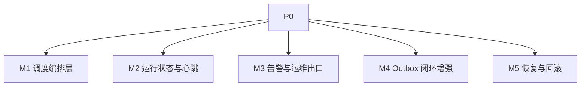
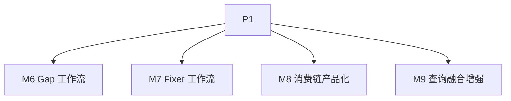
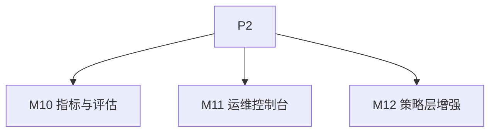

# wiki-mempalace 自动化中枢实施计划（P0–P2）

本文档把当前 `wiki-mempalace` 从“可运行的本地知识系统”推进到“稳定的自动化中枢”。

目标读者：

- 负责拆任务和排期的人
- 并行开发的多个 Agent / 工程师
- 负责测试、验收、上线和回滚的人

本文档强调两件事：

1. **按阶段推进**：P0 → P1 → P2，先打通主链路，再补维护闭环，最后补成熟能力。
2. **按模块交付**：每个模块独立开发、独立测试、独立验收，不把 bug 积压到最后统一爆发。

---

## 1. 目标与原则

### 1.1 总目标

把当前系统升级为一个可长期运行的知识自动化中枢，满足以下要求：

- 原始资料能够稳定进入系统
- 知识状态能够被规则驱动维护
- 事件能够驱动下游同步与维护动作
- 运行状态可观测、可告警、可恢复
- 可通过 CLI / MCP / 定时任务稳定被外部 Agent 调用

### 1.2 非目标

本计划**不**把以下内容放入关键路径：

- 花哨的前端 UI
- 多人协作产品化
- 复杂权限中心
- 公开分享站点
- 大规模多租户能力

这些可以后续扩展，但不影响“自动化中枢”成立。

### 1.3 设计原则

- **主库唯一**：`wiki.db` 是主写入中心，`palace.db` 是事件同步后的第二记忆层。
- **事件优先**：跨模块联动优先经由 outbox，而不是隐式耦合。
- **模块闭环**：每个模块完成后立刻测试、验收、记录结果。
- **小步上线**：每个阶段都要求可运行、可回滚、可观察。
- **文档先行**：模块接口、状态机、验收方法必须先写清楚。

---

## 2. 当前系统基线

### 2.1 已有能力

- `wiki-cli`：CLI 与统一 MCP 入口
- `wiki-kernel`：ingest / query / lint / promote / crystallize / maintenance
- `wiki-storage`：`wiki.db` 快照、outbox、embedding
- `wiki-mempalace-bridge`：outbox 消费、mempalace tools、live sink / live search
- `rust-mempalace`：drawer / vector / kg / MCP
- Markdown 投影：`wiki/pages/...`、`index.md`、`log.md`、`reports/`

### 2.2 当前短板

- 自动化调度仍偏手动
- 运行心跳、失败监控、告警不足
- 维护链路还没有形成完整闭环
- `Gap / Fixer / QA / Synthesizer` 尚未产品化为标准自动流程
- mempalace 与 wiki 读链路仍偏分离
- 缺少专门的运维状态面板和恢复 runbook

---

## 3. 阶段总览

### 3.1 P0 目标

把系统从“能用”变成“能稳定自动跑”。

### 3.2 P1 目标

把系统从“自动执行命令”变成“自动发现问题并推进知识维护”。

### 3.3 P2 目标

把系统从“自动化工具链”变成“可持续运营的平台”。

---

## 4. 模块划分

整个计划按以下功能模块拆分。每个模块都可以成为一个独立开发单元。

| 模块编号 | 模块名 | 主要职责 | 主要代码范围 |
| --- | --- | --- | --- |
| M1 | 调度编排层 | 定时、任务编排、任务依赖、任务状态 | `wiki-cli` + `scripts/` + 新增调度模块 |
| M2 | 运行状态与心跳 | 最近运行、成功/失败、耗时、心跳、重试 | `wiki-storage` / 新增状态表或文件 |
| M3 | 告警与运维出口 | 失败告警、状态摘要、人工介入入口 | `wiki-cli` / `scripts/` / 可选通知模块 |
| M4 | Outbox 闭环增强 | 完整事件消费、事件派发、消费健康 | `wiki-core::events` / `wiki-mempalace-bridge` |
| M5 | 恢复与回滚 | 备份、恢复、重建、演练脚本 | `scripts/backup.sh` + 新文档/脚本 |
| M6 | Gap 工作流 | 识别知识缺口，产出建议或草稿 | `wiki-kernel` / `wiki-cli` |
| M7 | Fixer 工作流 | 把 lint 结果分流成自动修、草稿修、人工修 | `wiki-kernel` / `wiki-cli` |
| M8 | 消费链产品化 | QA / synthesis / crystallize 标准入口 | `wiki-cli` / `wiki-kernel` |
| M9 | 查询融合增强 | 更深接入 mempalace 召回到 wiki 查询 | `wiki-kernel` / `wiki-mempalace-bridge` |
| M10 | 指标与评估 | ingest / lint / query / stale / promotion 指标 | `wiki-storage` / `wiki-cli` |
| M11 | 运维控制台 | 统一状态查看页或最小 Web UI | 新增 `viewer` 或 `dashboard` 模块 |
| M12 | 策略层增强 | 自动 supersede / crystallize / stale / retention 策略 | `wiki-core` / `wiki-kernel` |

---

## 5. 并行开发策略

### 5.1 并行原则

- 同一轮并行任务的写入范围尽量不重叠
- 先完成公共基础模块，再开发依赖模块
- 所有模块必须自带测试，不接受“先实现，最后一起补测试”

### 5.2 推荐并行批次

#### 批次 A：P0 基础设施

- Agent A1：M1 调度编排层
- Agent A2：M2 运行状态与心跳
- Agent A3：M5 恢复与回滚

#### 批次 B：P0 可观测与事件

- Agent B1：M3 告警与运维出口
- Agent B2：M4 Outbox 闭环增强

#### 批次 C：P1 维护闭环

- Agent C1：M6 Gap 工作流
- Agent C2：M7 Fixer 工作流
- Agent C3：M8 消费链产品化

#### 批次 D：P1 / P2 检索与策略

- Agent D1：M9 查询融合增强
- Agent D2：M12 策略层增强

#### 批次 E：P2 成熟化

- Agent E1：M10 指标与评估
- Agent E2：M11 运维控制台

---

## 6. P0 开发计划

P0 的目标是：**系统能自动跑、跑坏了能看见、出事了能恢复。**

### M1. 调度编排层

#### 目标

建立统一任务调度入口，支持以下任务按固定顺序稳定运行：

- `batch-ingest`
- `lint`
- `maintenance`
- `consume-to-mempalace`
- `llm-smoke` / 健康检查

#### 交付内容

- 一个统一任务入口，例如：
  - `wiki-cli automation run <job>`
  - 或 `wiki-cli scheduler run-daily`
- 任务定义清单：
  - 每个任务的输入、输出、失败码
  - 任务之间的依赖顺序
- 任务执行记录接口
- 最小定时调用脚本

#### 子任务

1. 定义任务模型
2. 定义任务依赖顺序
3. 实现统一调度入口
4. 实现串行执行与失败中断
5. 实现 dry-run 模式

#### 测试与检查

开发完成后立刻执行：

- 单元测试
  - 任务依赖顺序正确
  - 失败中断逻辑正确
  - dry-run 不触发真实执行
- 集成测试
  - 用 fake job 验证编排顺序
  - 验证一个 job 失败后后续 job 不再运行
- 手工检查
  - 打印出的执行计划可读
  - 日志里能看出开始时间、结束时间、结果

#### 验收标准

- 能一条命令跑完整日常自动化链路
- 同一批任务的顺序稳定且可预测
- 任一子任务失败时，调度器能立即返回错误

#### 风险与回滚

- 风险：把现有单命令入口封装坏
- 回滚：保留现有 CLI 子命令不动，调度入口只做薄封装

---

### M2. 运行状态与心跳

#### 目标

把“任务有没有跑、什么时候跑的、成功没有、耗时多少”变成结构化状态。

#### 交付内容

- 运行状态存储设计，建议二选一：
  - `wiki.db` 新表
  - `wiki/ops/` 下结构化状态文件
- 每个任务运行记录字段：
  - `job_name`
  - `started_at`
  - `finished_at`
  - `status`
  - `duration_ms`
  - `error_summary`
  - `heartbeat_at`
- 最近一次成功时间查询接口

#### 子任务

1. 设计运行状态模型
2. 持久化运行记录
3. 暴露读取接口
4. 提供“最近一次成功/失败”摘要命令

#### 测试与检查

- 单元测试
  - 成功记录写入
  - 失败记录写入
  - heartbeat 刷新逻辑
- 集成测试
  - 连续跑两次同一任务，状态能正确覆盖/追加
  - 中途失败能保留错误摘要
- 手工检查
  - 直接从数据库或状态文件读出最近运行信息

#### 验收标准

- 能在 10 秒内判断“某任务最近是否成功运行”
- 能看到最近一次失败原因的摘要
- 心跳字段能反映长任务仍在运行

#### 风险与回滚

- 风险：状态写入反过来影响主任务稳定性
- 回滚：运行状态写入失败时不影响主任务，只记录 stderr

---

### M3. 告警与运维出口

#### 目标

把“失败了”从日志里提升成可被人及时看到的信号。

#### 交付内容

- `wiki-cli ops status`
- `wiki-cli ops health`
- `wiki-cli ops last-failures`
- 最小告警机制，建议优先顺序：
  - 本地通知
  - 日志摘要文件
  - 邮件 / Webhook（后补）

#### 子任务

1. 健康状态聚合逻辑
2. 失败摘要输出
3. 告警阈值设计
4. 最小通知实现

#### 测试与检查

- 单元测试
  - 健康判断逻辑正确
  - 超时阈值判断正确
- 集成测试
  - 模拟任务连续失败，健康状态变红
  - 模拟 36 小时无心跳，健康状态报警
- 手工检查
  - 本地一条命令能看懂系统当前状态

#### 验收标准

- 任一关键任务连续失败时，有明确告警输出
- 任一任务超出最大允许静默时间时，有明确告警输出

#### 风险与回滚

- 风险：告警过多导致噪音
- 回滚：先仅输出本地摘要，不接外部通知

---

### M4. Outbox 闭环增强

#### 目标

把 outbox 从“能导出事件”升级成“能稳定驱动下游动作”的正式总线。

#### 交付内容

- 梳理全部事件清单，明确：
  - 谁产生
  - 谁消费
  - 消费后的动作
- 对关键事件建立消费闭环
- 消费健康检查与积压检查

#### 子任务

1. 产出事件矩阵文档
2. 校验关键事件派发链
3. 增加消费统计
4. 增加 outbox backlog 检查

#### 优先闭环事件

- `SourceIngested`
- `ClaimUpserted`
- `ClaimSuperseded`
- `QueryServed`
- `SessionCrystallized`
- `LintRunFinished`

#### 测试与检查

- 单元测试
  - 每种事件都能被正确识别
  - resolver 恢复 claim / scope 正确
- 集成测试
  - 从 wiki 写入到 bridge 消费再到 mempalace 落库全链路跑通
  - scope filter 生效
  - backlog 统计正确
- 手工检查
  - `consume-to-mempalace --last-id 0` 能输出稳定消费结果

#### 验收标准

- 关键事件都能找到明确消费端
- outbox 堆积可以被检测
- 关键消费链路有自动化测试覆盖

#### 风险与回滚

- 风险：事件语义调整破坏旧 consumer
- 回滚：保留旧消费函数，新增增强版路径

---

### M5. 恢复与回滚

#### 目标

建立真正可执行的备份、恢复、重建流程。

#### 交付内容

- 备份策略文档
- 恢复脚本或恢复命令清单
- 故障演练步骤
- 数据重建路径说明：
  - 从 vault 重建 `wiki.db`
  - 从 outbox 重放 `palace.db`

#### 子任务

1. 规范现有 `backup.sh`
2. 增加恢复文档
3. 增加恢复演练脚本
4. 增加“恢复成功检查”命令

#### 测试与检查

- 脚本测试
  - 备份文件存在
  - 备份库可打开
- 演练测试
  - 从备份恢复 `wiki.db`
  - 重新消费 outbox 恢复 `palace.db`
- 手工检查
  - 有一份清晰 runbook，新人也能照着恢复

#### 验收标准

- 任意一天的主库都可恢复
- 任意一次恢复都有可重复步骤
- 恢复后能跑通最小健康检查

#### 风险与回滚

- 风险：备份策略影响在线性能
- 回滚：先保持低频快照，逐步提高频率

---

## 7. P1 开发计划

P1 的目标是：**系统能自己发现问题、提出下一步、并沉淀消费结果。**

### M6. Gap 工作流

#### 目标

从现有知识库里识别“该补什么”，而不是只被动等人喂内容。

#### 交付内容

- `wiki-cli gap`
- Gap 规则集合，例如：
  - `gap.missing_xref`
  - `gap.low_coverage`
  - `gap.orphan_source`
  - `gap.unresolved_cluster`
- 可选：
  - 仅报告
  - 生成 draft page

#### 子任务

1. 定义 gap finding 结构
2. 将 gap 扫描接入 `wiki-kernel`
3. 暴露 CLI 命令
4. 输出 markdown 报告
5. 支持生成草稿页

#### 测试与检查

- 单元测试
  - 每类 gap 规则都可触发
- 集成测试
  - 构造低覆盖知识集，能稳定产出 gap
  - 生成的 draft page 状态正确
- 手工检查
  - 输出列表对人是有用的，不是噪音

#### 验收标准

- 至少 3 类 gap 规则可稳定工作
- draft 产物能进入正常 lint / promote 链路

---

### M7. Fixer 工作流

#### 目标

把 lint 结果转成明确可执行的修复动作。

#### 交付内容

- `wiki-cli fix`
- fix 分类：
  - 自动修复
  - 生成修复草稿
  - 标记人工修复

#### 子任务

1. 定义 fix action 模型
2. 将 lint finding 映射到 fix action
3. 实现可安全自动修复的最小集合
4. 其余项输出草稿或人工队列

#### 测试与检查

- 单元测试
  - finding 到 fix action 映射正确
- 集成测试
  - 自动修复后重新 lint，问题消失
  - 人工项不会被误自动修
- 手工检查
  - fix 结果可解释

#### 验收标准

- 一部分低风险 lint 问题可自动修复
- 修复后系统状态更健康，不引入新错误

---

### M8. 消费链产品化

#### 目标

把 `query --write-page`、`crystallize`、QA / synthesis 沉淀统一成稳定入口。

#### 交付内容

- 标准消费入口设计：
  - `qa`
  - `synthesis`
  - `crystallize`
- 统一的 page 生成规范
- 写回后的状态、entry_type、审计策略一致化

#### 子任务

1. 梳理当前消费入口
2. 统一输入输出契约
3. 明确 entry_type / status 规则
4. 增加测试夹具

#### 测试与检查

- 单元测试
  - page 产物 entry_type 正确
  - 状态初始化正确
- 集成测试
  - 生成 page 后可被 lint 正常处理
  - query / crystallize / qa / synthesis 入口语义一致
- 手工检查
  - 产物结构可读、可追溯

#### 验收标准

- 消费产物进入统一 page 生命周期
- 至少两类消费场景有端到端用例

---

### M9. 查询融合增强

#### 目标

让 wiki query 更自然地吃到 mempalace 的召回能力，而不是完全分家。

#### 交付内容

- 设计统一召回入口
- 支持可选注入 mempalace search / graph 结果
- 明确排序与过滤规则

#### 子任务

1. 梳理当前 `wiki query` 与 `mempalace search` 分工
2. 设计融合策略
3. 接入 `SearchPorts`
4. 补 explain / 调试输出

#### 测试与检查

- 单元测试
  - 融合排序稳定
  - 去重正确
- 集成测试
  - mempalace 候选加入后确实影响 top results
  - scope 过滤正确
- 手工检查
  - explain 输出能解释结果来源

#### 验收标准

- 至少一个 query 路径能稳定接入 mempalace 候选
- 结果质量相较纯 wiki 路径可观提升

---

## 8. P2 开发计划

P2 的目标是：**让系统变成可长期运营的平台，而不是一组命令。**

### M10. 指标与评估

#### 目标

让系统不仅能运行，还能回答“运行得怎么样”。

#### 交付内容

- ingest 数量趋势
- lint finding 趋势
- stale claim / page 趋势
- promotion 成功率
- query 命中来源分布

#### 测试与检查

- 单元测试：指标聚合正确
- 集成测试：从真实运行记录产生统计结果
- 手工检查：指标输出对决策有意义

#### 验收标准

- 至少 5 类核心指标可稳定查看

---

### M11. 运维控制台

#### 目标

把状态、告警、指标和任务运行统一放进一个可读面板。

#### 交付内容

- 最小 Web 页或本地 dashboard
- 查看项：
  - 任务状态
  - 最近失败
  - outbox backlog
  - mempalace 消费状态
  - 核心指标

#### 测试与检查

- 组件测试：页面能读取真实状态
- 集成测试：异常状态能正确显示
- 手工检查：非开发者也能读懂

#### 验收标准

- 不进数据库也能快速判断系统状态

---

### M12. 策略层增强

#### 目标

让系统从“规则执行器”升级为“规则管理者”。

#### 交付内容

- 自动 supersede 候选
- 自动 crystallize 候选
- stale / retention 策略增强
- 低风险自动状态推进建议

#### 测试与检查

- 单元测试：策略判断稳定
- 集成测试：策略不会误伤现有主流程
- 手工检查：建议结果可信、可解释

#### 验收标准

- 至少 2 类自动建议策略可进入日常使用

---

## 9. 模块完成后的统一检查模板

每个模块完成后，必须走同一套检查模板。

### 9.1 开发完成检查

- [ ] 代码已提交到独立分支
- [ ] 模块范围内文档已更新
- [ ] 模块接口、状态、失败行为已写清楚

### 9.2 自动测试检查

- [ ] 单元测试已新增
- [ ] 集成测试已新增
- [ ] 旧测试未回归
- [ ] `cargo test --workspace` 全绿

### 9.3 手工验收检查

- [ ] 有一条最小 happy path
- [ ] 有一条失败 path
- [ ] 有一条恢复/重试 path

### 9.4 可观测性检查

- [ ] 日志可读
- [ ] 状态可查
- [ ] 错误摘要能看懂

### 9.5 合并前检查

- [ ] 与其他模块无明显接口冲突
- [ ] 回滚方式已写明
- [ ] 变更已同步到主计划文档

---

## 10. 推荐的测试分层

为了避免最后一次统一检查时 bug 集中爆发，所有模块统一采用三层测试。

### T1. 单元测试

目的：验证纯逻辑正确。

适用：

- 状态转换
- 规则判断
- 排序融合
- finding / action 映射
- 配置解析

### T2. 集成测试

目的：验证模块间协作正确。

适用：

- CLI 命令调用
- `wiki.db` 写入/读取
- outbox 消费
- bridge 到 mempalace
- Markdown 投影生成

### T3. 场景测试

目的：验证真实工作流不崩。

适用：

- 每日自动任务链
- ingest → lint → maintenance → consume
- query → write-page → promote
- backup → restore → replay

### T4. 运行中检查

目的：验证上线后真实运行状态。

适用：

- 心跳文件
- 最近成功时间
- outbox backlog
- 告警是否触发

---

## 11. 里程碑与建议排期

### 第 1 周：P0 基础设施

- M1 调度编排层
- M2 运行状态与心跳
- M5 恢复与回滚

### 第 2 周：P0 闭环与可观测

- M3 告警与运维出口
- M4 Outbox 闭环增强
- P0 联调、故障演练

### 第 3 周：P1 维护闭环

- M6 Gap 工作流
- M7 Fixer 工作流

### 第 4 周：P1 消费链

- M8 消费链产品化
- M9 查询融合增强
- P1 联调

### 第 5–6 周：P2 成熟化

- M10 指标与评估
- M11 运维控制台
- M12 策略层增强

---

## 12. 最终验收标准

当以下条件同时满足时，可以认为系统达到了“自动化中枢”基线：

- 每日主链路可以无需人工稳定运行
- 关键任务失败能被及时发现
- 核心状态可通过命令或面板快速查看
- 数据损坏后可按 runbook 恢复
- 维护链路已能主动发现问题并给出下一步
- 消费链能把查询结果沉淀回知识库
- 至少一部分 mempalace 能力被稳定接入 wiki 主查询

---

## 13. 给任务协调者的使用建议

### 分派方式

- 一个 Agent 只负责一个模块
- 模块拆分后先补测试，再补实现，再补文档
- 不要把两个高耦合模块同时改同一组文件

### 每轮同步要求

每个 Agent 汇报时必须给出：

- 本轮改了什么
- 当前测试情况
- 当前阻塞是什么
- 是否影响别的模块

### 不允许的做法

- 先写一大坨，再统一补测试
- 先改接口，后通知别的 Agent
- 把“监控 / 恢复 / 验收”留到最后

---

## 14. 结论

当前 `wiki-mempalace` 已经具备自动化中枢的核心雏形：

- 有主库
- 有事件
- 有命令入口
- 有第二记忆层
- 有 MCP

接下来真正决定它能不能长期顶替 Notion 工作流的，不是 UI，而是四件事：

- **调度**
- **闭环**
- **可观测**
- **恢复**

因此本实施计划把 P0 压在基础设施和运维能力上，把 P1 压在维护闭环上，把 P2 压在平台成熟度上。这是最稳、也最适合多 Agent 并行开发的路径。
