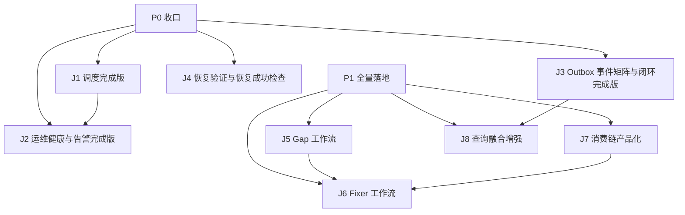

# wiki-mempalace 第二批 Issue / Task List 模板

本文档基于 [automation-implementation-plan.md](/Users/mac-mini/wiki-migration/wiki-mempalace/docs/automation-implementation-plan.md) 和当前仓库真实实现，给出：

1. 一份 **P0 / P1 开发进度盘点**
2. 一份 **batch-2 开发计划**

这份 batch-2 的目标很明确：

- **收口 P0 剩余项**
- **完成 P1 全部开发项**
- 保持模块化、可并行、可测试、可验收

本批次**不包含 P2**。P2 的指标、控制台、策略层增强继续留在后续批次。

---

## 使用方式

- 每个 Issue 可直接分配给一个 Agent 或一个工程师
- 多 Agent 并行时，优先按“建议 owner 范围”拆分，尽量避免同一轮多人同时改 `crates/wiki-cli/src/main.rs`
- 每个模块完成后，**必须在本模块内完成测试、检查、验收**
- 不允许把测试债、文档债、回滚说明积压到最后一轮统一处理

---

## 进度盘点

下表以 [automation-implementation-plan.md](/Users/mac-mini/wiki-migration/wiki-mempalace/docs/automation-implementation-plan.md) 为基线，对当前代码状态做一次真实对照。

| 模块             | 计划目标                                               | 当前状态              | 当前证据                                                                                                         | batch-2 要补什么        |
| -------------- | -------------------------------------------------- | ----------------- | ------------------------------------------------------------------------------------------------------------ | ------------------- |
| M1 调度编排层       | 统一自动化任务入口、任务顺序、dry-run、失败短路                        | **✅ 已完成**         | `list-jobs`、`run <job>`、完整 job registry、5 jobs、灵活 vault 默认路径                                                 | 无                   |
| M2 运行状态与心跳     | 持久化任务运行状态、最近成功/失败、心跳                               | **✅ 已完成**         | `AutomationHeartbeat` 长任务心跳刷新、`status`/`doctor` 命令                                                           | 阈值可考虑提为配置（低优先级）     |
| M3 告警与运维出口     | 失败告警、状态聚合、last failures、health                     | **✅ 已完成**         | `health`（green/yellow/red）、`last-failures`、阈值判定、stderr 告警出口                                                  | 无                   |
| M4 Outbox 闭环增强 | 事件矩阵、消费闭环、消费健康、backlog                             | **✅ 已完成**         | `docs/outbox-event-matrix.md`、bridge 结构化 dispatch stats、CLI `consume-to-mempalace` 闭环摘要、active/ignored 全链路测试 | 无                   |
| M5 恢复与回滚       | 备份、恢复、重建、演练、恢复成功检查                                 | **✅ 已完成**         | `automation verify-restore`、升级后的 `recovery-drill.sh`、`recovery-drill-template.md`、CLI + 脚本行为测试               | 无                   |
| M6 Gap 工作流     | 发现知识缺口、产出报告或草稿                                     | **未开始**           | 无 `gap` 命令、无 gap 规则集合                                                                                        | 全量实现                |
| M7 Fixer 工作流   | 把 lint finding 转成 fix actions                      | **未开始**           | 无 `fix` 命令、无 fix action 模型                                                                                   | 全量实现                |
| M8 消费链产品化      | 统一 qa / synthesis / crystallize / query-write-page | **未开始（仅有零散基础能力）** | 现有 `query --write-page`、`crystallize`、entry_type/status 零散逻辑                                                 | 抽成统一消费入口和统一 page 契约 |
| M9 查询融合增强      | 把 mempalace 候选更自然接入 wiki query                     | **未开始（仅有桥接基础件）**  | 有 `MempalaceSearchPorts` / `live_ranker`，但 `wiki query` 仍以 in-memory 路为主                                     | 全量实现                |

### 当前结论

- **P0 已收口**（J1/J2/J3/J4 已完成）
- **P1 还没有正式启动**
- 下一步重心：收尾 J4，启动 P1（J5-J8）

---

## J1–J8 细分进度（2026-04-23 代码审计）

> 以下进度基于代码实际状态，而非文档或计划描述。每项交付物标注 ✅ 已完成 / ⚠️ 部分完成 / ❌ 未完成。

### J1. 调度完成版 — 完成度 100%

| 交付物                       | 状态  | 证据                                                                                                                                              |
| ------------------------- | --- | ----------------------------------------------------------------------------------------------------------------------------------------------- |
| `automation list-jobs`    | ✅   | `AutomationCmd::ListJobs`，输出格式 `- {name} daily=… requires_network=… :: {desc}`                                                                  |
| `automation run <job>`    | ✅   | `AutomationCmd::Run { job }`，clap value_enum 校验，未知 job 报错                                                                                       |
| 完整 job registry           | ✅   | `AUTOMATION_JOB_SPECS`：batch-ingest / lint / maintenance / consume-to-mempalace / llm-smoke，每个含 `in_daily` / `requires_network` / `description` |
| llm-smoke 健康检查 job        | ✅   | `in_daily: false, requires_network: true`，dispatch 调用 `smoke_chat_completion`                                                                   |
| restore success check job | ❌   | 未实现为 automation job（J4 范围）                                                                                                                      |
| job 帮助文案                  | ✅   | `Cmd::Automation` 有顶层 `/// Run, inspect, and monitor scheduled automation jobs.`；各子命令均有 `///` 注释                                                |
| 单元测试                      | ✅   | job 列表顺序稳定、unknown job 报错、`run <job>` 只跑目标（lint/maintenance 有覆盖）、run-daily 顺序                                                                   |
| 集成测试                      | ✅   | lint / maintenance / consume-to-mempalace / batch-ingest 均有 `run <job>` 集成测试；llm-smoke 依赖外部 LLM endpoint，CI 跳过                                  |

**遗留**：restore success check job（属 J4 范围）；llm-smoke 集成测试（需外部 LLM endpoint）。

### J2. 运维健康与告警完成版 — 完成度 100%

| 交付物                        | 状态  | 证据                                                                                         |
| -------------------------- | --- | ------------------------------------------------------------------------------------------ |
| `automation health`        | ✅   | green/yellow/red 三级，`collect_automation_health_report` + `render_automation_health_report` |
| `automation last-failures` | ✅   | `--limit` 参数，调 `repo.list_recent_failed_automation_runs`                                   |
| `automation doctor`        | ✅   | per-job 最新运行 + outbox + consumer 状态                                                        |
| `automation status`        | ✅   | per-job 最新运行摘要                                                                             |
| 阈值判定：stale heartbeat       | ✅   | `classify_stale_heartbeat`，yellow 6h / red 24h                                             |
| 阈值判定：consecutive failures  | ✅   | `classify_consecutive_failures`，yellow 2 / red 3                                           |
| 阈值判定：outbox backlog        | ✅   | `classify_backlog`，yellow 25 / red 100                                                     |
| stderr 彩色告警                | ✅   | `emit_automation_health_alert`，ANSI `\x1b[33m` / `\x1b[31m`                                |
| 非零退出                       | ✅   | Red → `exit(1)`；Yellow + `--exit-on-yellow` → `exit(1)`；Yellow 默认 exit 0                   |
| 本地摘要文件                     | ✅   | `--summary-file` 参数，`std::fs::write`                                                       |
| 长任务心跳刷新                    | ✅   | `AutomationHeartbeat` 结构体 + `tick()` 方法                                                    |
| 单元测试                       | ✅   | stale/consecutive/backlog 阈值分类、health report 渲染                                            |
| 阈值可配置                      | ✅   | `WIKI_HEALTH_`* 环境变量覆盖 6 个阈值，未设置时 fallback 到硬编码默认值；`env_or<T>` 辅助函数                        |

**遗留**：无。

### J3. Outbox 事件矩阵与闭环完成版 — 完成度 100%

| 交付物                       | 状态  | 证据                                                                                                                                                                                                                                                   |
| ------------------------- | --- | ---------------------------------------------------------------------------------------------------------------------------------------------------------------------------------------------------------------------------------------------------- |
| consume-to-mempalace 消费闭环 | ✅   | `run_consume_to_mempalace_job` 统一走 resolver + bridge stats；`--palace` 时启用 `LiveMempalaceSink`，否则走 `CliMempalaceSink`                                                                                                                                 |
| consumer progress / ack   | ✅   | `mark_outbox_processed` + `get_outbox_consumer_progress`；CLI 集成测试 `consume_to_mempalace_starts_from_latest_progress_and_advances_it`、`consume_to_mempalace_empty_increment_does_not_ack`                                                             |
| outbox backlog 统计         | ✅   | `get_outbox_stats` + backlog 计算；J2 的 `automation doctor/health` 已接入 consumer backlog 展示                                                                                                                                                              |
| WikiEvent 变体清单            | ✅   | 10 个变体：SourceIngested / ClaimUpserted / ClaimSuperseded / PageWritten / QueryServed / SessionCrystallized / GraphExpanded / LintRunFinished / PageStatusChanged / PageDeleted                                                                        |
| Bridge 结构化派发统计            | ✅   | `OutboxDispatchStats` + `OutboxEventDispatchStats`；新增 `consume_outbox_ndjson_with_stats` / `consume_outbox_ndjson_with_resolver_and_stats`，兼容 wrapper 仍返回 dispatched count                                                                           |
| Bridge 消费覆盖               | ✅   | **正式消费 3 类**：ClaimUpserted / ClaimSuperseded / SourceIngested；其余事件不再静默丢弃，而是明确计入 `ignored`；resolver 缺失的 claim upsert 计入 `unresolved`                                                                                                                  |
| consume-to-mempalace 输出升级 | ✅   | CLI 输出已固定为 `seen/dispatched/ignored/filtered/unresolved/start_id/acked/consumer_tag`                                                                                                                                                                 |
| 事件矩阵文档                    | ✅   | 新增 [docs/outbox-event-matrix.md](/Users/mac-mini/wiki-migration/wiki-mempalace/docs/outbox-event-matrix.md)，并回填到 `docs/architecture.md` / `docs/mempalace-linkage.md`                                                                                |
| 未消费事件策略                   | ✅   | `retained-no-consumer` / `defined-not-emitted` 已在矩阵中明确；`PageWritten` / `GraphExpanded` 明确标注为 defined-not-emitted                                                                                                                                     |
| 生产端事件测试                   | ✅   | `wiki-kernel` 新增 `crystallize_emits_session_crystallized_event`、`run_basic_lint_emits_lint_run_finished_event`、`record_query_emits_query_served_event`、`mark_stale_emits_page_status_changed_event`、`cleanup_expired_pages_emits_page_deleted_event` |
| Bridge 单元测试               | ✅   | `consumes_source_ingested`、`consumes_ndjson_and_dispatches_claim_events`、`resolver_path_materializes_claim_and_enforces_scope`、`stats_mark_unresolved_and_ignored_events`                                                                            |
| 端到端闭环测试                   | ✅   | CLI 集成测试 `consume_to_mempalace_dispatches_active_events_from_cli_flow`、`consume_to_mempalace_ignores_query_crystallize_and_lint_events`                                                                                                              |
| 文档一致性测试                   | ✅   | `event_matrix_doc_stays_in_sync_with_wiki_event_variants` 会校验 `docs/outbox-event-matrix.md` 与 `WikiEvent` 变体集合不漂移                                                                                                                                    |
| consumer lag 验收用例         | ✅   | CLI 集成测试覆盖 progress 起点/ack 前进；J2 的 `automation doctor` / `automation health` 已验证 backlog 展示与阈值；手工 smoke 已验证 active/ignored 两条消费链都能给出一行闭环摘要                                                                                                           |

**遗留**：无。J3 范围内的事件矩阵、消费边界、结构化统计、自动化测试与手工验收均已完成。

### J4. 恢复验证与恢复成功检查 — 完成度 100%

| 交付物                         | 状态  | 证据                                                                                                                   |
| --------------------------- | --- | -------------------------------------------------------------------------------------------------------------------- |
| `recovery-runbook.md`       | ✅   | 验证步骤已收敛到 `automation verify-restore`，并明确 drill 会实际重建 `palace.db`                                                     |
| `scripts/recovery-drill.sh` | ✅   | scratch 恢复 + integrity_check + vault 校验 + 实际执行 `consume-to-mempalace` + `automation verify-restore`                  |
| CI `bash -n`                | ✅   | `ci-quick.yml` 含 `bash -n scripts/recovery-drill.sh`                                                                 |
| 恢复成功检查命令                    | ✅   | `wiki-cli automation verify-restore`，统一检查 `wiki.db` / vault / 可选 `palace.db`                                         |
| palace.db 重建验证              | ✅   | drill 脚本默认实际重建 scratch `palace.db` 并做 verify；行为测试覆盖成功与失败场景                                                           |
| 演练记录模板                      | ✅   | 新增 `docs/recovery-drill-template.md`                                                                                 |
| CLI 集成测试                    | ✅   | `automation_verify_restore_`* 成功/失败场景覆盖有效 vault、缺 sources、缺 status、缺 palace 核心表                                      |
| 演练行为测试                      | ✅   | `recovery_drill_script_restores_and_rebuilds_palace`、`recovery_drill_script_fails_when_sources_dir_missing_from_tar` |
| CI smoke                    | ✅   | `ci-quick.yml` 新增最小 vault fixture + `automation verify-restore` smoke                                                |

**遗留**：无。J4 范围内的统一验证入口、真实 drill、模板、测试和文档已完成。

### J5. Gap 工作流 — 完成度 0%

| 交付物                                                 | 状态  | 证据  |
| --------------------------------------------------- | --- | --- |
| `wiki-cli gap` 命令                                   | ❌   | 无   |
| `GapFinding` 结构                                     | ❌   | 无   |
| gap 规则（missing_xref / low_coverage / orphan_source） | ❌   | 无   |
| markdown 报告                                         | ❌   | 无   |

### J6. Fixer 工作流 — 完成度 0%

| 交付物                     | 状态  | 证据  |
| ----------------------- | --- | --- |
| `wiki-cli fix` 命令       | ❌   | 无   |
| `FixAction` 模型          | ❌   | 无   |
| finding → fix action 映射 | ❌   | 无   |
| 低风险自动修复集合               | ❌   | 无   |

### J7. 消费链产品化 — 完成度 20%

| 交付物                         | 状态  | 证据                                                                        |
| --------------------------- | --- | ------------------------------------------------------------------------- |
| `query --write-page`        | ✅   | `Query` 子命令含 `--write-page` + `--entry-type`                              |
| `crystallize`               | ✅   | `Crystallize` 子命令含 `--entry-type` + `--finding`                           |
| `EntryType` / `EntryStatus` | ✅   | `schema.rs`：Concept/Principle/…/Index；Draft/InReview/Approved/NeedsUpdate |
| 统一消费入口                      | ❌   | query-write-page 和 crystallize 仍为独立路径，无统一入口                               |
| 统一 page contract            | ❌   | 无 `PageContract` 类型或统一产物契约                                                |
| qa / synthesis 命令           | ❌   | 无独立 qa / synthesis 子命令                                                    |
| frontmatter 统一审计            | ⚠️  | 有 vault-standards.md 但代码中各入口的 frontmatter 生成逻辑分散                          |

### J8. 查询融合增强 — 完成度 10%

| 交付物                        | 状态  | 证据                                                             |
| -------------------------- | --- | -------------------------------------------------------------- |
| `MempalaceSearchPorts`     | ✅   | `live_search.rs` 有实现                                           |
| `LiveMempalaceGraphRanker` | ✅   | `live_ranker.rs` 有实现                                           |
| wiki query 接入 mempalace 候选 | ❌   | CLI query 主路径仍用 `InMemorySearchPorts`，未调用 bridge 的 live search |
| explain 输出                 | ❌   | 无                                                              |
| scope 过滤 / 去重              | ⚠️  | `LiveMempalaceSink` 有 `scope_filter`；query 侧未接入                |

---

## 总进度汇总

| Job          | 完成度      | 阶段  | 状态                  |
| ------------ | -------- | --- | ------------------- |
| J1 调度完成版     | **100%** | P0  | ✅ 已完成               |
| J2 运维健康与告警   | **100%** | P0  | ✅ 已完成               |
| J3 Outbox 闭环 | **100%** | P0  | ✅ 已完成               |
| J4 恢复验证      | **100%** | P0  | ✅ 已完成               |
| J5 Gap 工作流   | **0%**   | P1  | ❌ 未开始               |
| J6 Fixer 工作流 | **0%**   | P1  | ❌ 未开始               |
| J7 消费链产品化    | **20%**  | P1  | ⚠️ 零散能力在，统一契约缺      |
| J8 查询融合增强    | **10%**  | P1  | ⚠️ 桥接基础件在，query 未接入 |

---

## Batch-2 总目标

batch-2 完成后，系统应满足：

- 日常自动化链路不仅能跑，还能解释“为什么失败、该怎么介入”
- outbox 不只是 mempalace 同步管道，而是清晰、有文档、有测试的事件总线
- 系统可以主动发现 gap，自动或半自动生成修复动作
- 消费链产物（qa / synthesis / crystallize / query page）进入统一 page 生命周期
- wiki 查询能以稳定、可解释的方式吃到 mempalace 候选

---

## Batch-2 总览

---

## 推荐并行方式

### 并行批次 A：P0 收口

- Agent A1：J1 调度完成版
- Agent A2：J2 运维健康与告警完成版
- Agent A3：J4 恢复验证与恢复成功检查

### 并行批次 B：事件总线

- Agent B1：J3 Outbox 事件矩阵与闭环完成版

### 并行批次 C：P1 维护闭环

- Agent C1：J5 Gap 工作流
- Agent C2：J7 消费链产品化
- Agent C3：J6 Fixer 工作流

### 并行批次 D：查询增强

- Agent D1：J8 查询融合增强

说明：

- `J2` 和 `J1` 可能都要碰 `wiki-cli`，建议 `J1` 先冻结调度接口，再接 `J2`
- `J6` 依赖 `J5` 的 finding 结构和 `J7` 的统一产物契约，因此建议排在 `J5/J7` 之后
- `J8` 依赖 `J3` 明确事件/消费边界，否则容易把 mempalace 接入做成新的隐式耦合

---

## J1. 调度完成版

### 标题

`P0 / M1: 把 automation 从单一 daily 命令提升为完整调度入口`

### 背景

当前 `automation run-daily` 已经存在，但它更像一条硬编码流水线，还不算“完整调度面”。

### 目标

让调度层具备更完整的任务集合和更清晰的任务定义，而不是只有一个 daily happy path。

### 范围

- 增加 named jobs 视图，例如：
  - `automation list-jobs`
  - `automation run <job>`
- 补全健康检查 job：
  - `llm-smoke`
  - 最小 restore success check（若 J4 先完成，可在这里接入）
- 明确每个 job 的输入、输出、失败语义

### 建议 owner 范围

- `crates/wiki-cli/`
- 如需要可加 `docs/` 的命令说明

### 交付物

- `automation list-jobs`
- `automation run <job>`
- 完整 job registry
- job 帮助文案

### 实施步骤

1. 抽象 job registry
2. 把 `run-daily` 使用的固定 job 列表迁到 registry
3. 实现 `list-jobs`
4. 实现 `run <job>`
5. 把 `llm-smoke` / 恢复成功检查纳入可选 job

### 测试

- 单元测试：
  - job 列表稳定
  - 未知 job 报错正确
  - `run <job>` 只执行目标 job
- 集成测试：
  - `run lint`、`run maintenance` 行为等价原子命令
  - `run-daily` 仍保持既有顺序
- 手工检查：
  - `--help` 能看懂
  - 输出包含 job 名称、状态、耗时

### 验收标准

- 调度不再只有一条硬编码 daily 路径
- 新增 job 不需要复制大段 match 逻辑
- `run-daily` 和 `run <job>` 语义清晰、不冲突

### 风险

- job registry 抽象过重，反而把 CLI 搞复杂

### 回滚

- 保留 `run-daily` 路径，registry 先做最小枚举表

---

## J2. 运维健康与告警完成版

### 标题

`P0 / M2+M3: 把运行状态升级为真正的 health / alert 面`

### 背景

当前已经能看到最近运行状态和 outbox backlog，但还缺：

- 超时阈值
- 连续失败判断
- 最近失败列表
- 最小告警出口

### 目标

让操作者在不翻原始日志的情况下，能判断系统是不是健康、哪里坏了、多久没恢复。

### 范围

- 新增：
  - `automation last-failures`
  - `automation health`
- 增加健康判定规则：
  - 长时间无心跳
  - 连续失败
  - outbox backlog 超阈值
- 增加最小告警出口：
  - 本地摘要文件
  - stderr 标红 / 非零退出

### 建议 owner 范围

- `crates/wiki-storage/`
- `crates/wiki-cli/`
- `scripts/`（如需要最小告警脚本）

### 交付物

- 健康状态聚合逻辑
- 连续失败判断
- `last-failures` 命令
- `health` 命令
- 最小告警策略文档

### 实施步骤

1. 定义健康状态枚举（green/yellow/red）
2. 定义阈值配置或最小常量
3. 增加最近失败列表查询
4. 增加 `health` 聚合输出
5. 接入 outbox backlog / consumer lag
6. 接入本地告警出口

### 测试

- 单元测试：
  - 超时规则触发正确
  - 连续失败统计正确
  - backlog 阈值判断正确
- 集成测试：
  - 构造连续失败任务历史
  - 构造 36 小时无心跳
  - 构造 backlog 超阈值
- 手工检查：
  - 一屏输出能看懂
  - 人能据此决定是否要人工介入

### 验收标准

- 关键 job 异常可被明确标红
- 最近失败列表能直接指向问题点
- health 输出可作为后续外部监控的输入

### 风险

- 阈值过严导致噪音

### 回滚

- 先把告警只做成本地摘要，不连外部通知

---

## J3. Outbox 事件矩阵与闭环完成版

### 标题

`P0 / M4: 把 outbox 从“可消费”补成“有契约、有矩阵、有闭环”的总线`

### 背景

当前 mempalace 主链已经能做增量消费和 ack，但 M4 计划里还有两块没收口：

- 事件矩阵文档化
- 非 mempalace 事件的消费定位和验证

### 目标

把 outbox 变成真正可维护的总线，而不是“只有当前作者知道哪些事件有用”。

### 范围

- 梳理并固化事件矩阵
- 明确这些事件的生产者、消费者、动作、测试覆盖：
  - `SourceIngested`
  - `ClaimUpserted`
  - `ClaimSuperseded`
  - `QueryServed`
  - `SessionCrystallized`
  - `LintRunFinished`
- 增加最小端到端测试
- 明确“未消费事件”的策略：无消费者、保留、未来用途

### 建议 owner 范围

- `docs/`
- `crates/wiki-core/`
- `crates/wiki-cli/`
- `crates/wiki-mempalace-bridge/`

### 交付物

- 事件矩阵文档
- 关键事件的消费契约说明
- 最小端到端闭环测试
- backlog / consumer lag 的验收用例

### 实施步骤

1. 产出事件矩阵表
2. 为每类关键事件标出生产端和消费端
3. 对没有消费端的事件做明确标注
4. 补齐自动化测试
5. 更新相关架构文档

### 测试

- 单元测试：
  - resolver 还原 claim / scope 正确
  - 事件派发映射正确
- 集成测试：
  - `ingest -> outbox -> consume -> palace` 全链路
  - `query/crystallize/lint` 对应事件存在且格式稳定
  - consumer backlog 统计正确
- 手工检查：
  - 文档一眼能看出“谁发、谁收、干什么”

### 验收标准

- 关键事件都有明确消费去向或明确“暂不消费”说明
- 关键消费链路都至少有一条自动化测试
- 后续开发者不需要靠读源码猜事件语义

### 风险

- 文档与代码再次漂移

### 回滚

- 先把矩阵当源码事实的镜像，不在第一步强行改动事件结构

---

## J4. 恢复验证与恢复成功检查

### 标题

`P0 / M5: 从“有 runbook”推进到“有恢复成功检查 + 有演练记录”`

### 背景

当前恢复 runbook 和 drill 脚本已经有了，但还缺两类东西：

- 恢复成功检查命令
- 一次更正式的 `palace.db` 重建验证流程

### 目标

把恢复流程从“文档可读”推进到“脚本和命令可复用”。

### 范围

- 增加恢复成功检查命令，例如：
  - `automation verify-restore`
  - 或 `scripts/restore-check.sh`
- 明确 `palace.db` 重建后的验证步骤
- 产出演练记录模板

### 建议 owner 范围

- `scripts/`
- `docs/`
- 如需命令则可改 `crates/wiki-cli/`

### 交付物

- 恢复成功检查命令或脚本
- `palace.db` 重建验证步骤
- 演练记录模板

### 实施步骤

1. 定义恢复后最小健康检查项
2. 实现恢复成功检查脚本/命令
3. 把 `palace.db` 重建验证写进 runbook
4. 增加一份 drill 记录模板

### 测试

- 脚本测试：
  - 能识别 `wiki.db` 不完整
  - 能识别 vault 缺目录
- 演练测试：
  - scratch 环境跑一遍 `wiki.db` 恢复
  - scratch 环境给出 `palace.db` 重建成功验证步骤
- 手工检查：
  - 新人按 runbook 可以完成一轮演练

### 验收标准

- 恢复后有统一的成功检查入口
- `palace.db` 重建不再只停留在“命令建议”
- drill 结果可记录、可复盘

### 风险

- 为了自动化检查而误碰生产路径

### 回滚

- 所有恢复验证继续限定在 scratch 路径

---

## J5. Gap 工作流

### 标题

`P1 / M6: 正式落地 gap 发现与 gap 报告`

### 背景

当前系统仍是被动 ingest / query / maintenance，没有主动告诉操作者“哪里值得补”。

### 目标

落地第一版 `gap`，让系统能自己发现知识缺口。

### 范围

- 新增 `wiki-cli gap`
- 第一版至少实现 3 类 gap：
  - `gap.missing_xref`
  - `gap.low_coverage`
  - `gap.orphan_source`
- 输出 markdown 报告
- 可选生成 draft page

### 建议 owner 范围

- `crates/wiki-kernel/`
- `crates/wiki-cli/`

### 交付物

- gap finding 结构
- gap 扫描逻辑
- CLI 命令
- markdown 报告输出

### 实施步骤

1. 定义 `GapFinding`
2. 实现第一版规则集
3. 接到 `wiki-kernel`
4. 暴露 `wiki-cli gap`
5. 输出 markdown 报告
6. 可选支持 `--write-page`

### 测试

- 单元测试：
  - 每类规则都能触发
- 集成测试：
  - 构造低覆盖知识集
  - 构造 orphan source
  - 构造缺失 xref
- 手工检查：
  - gap 输出不是噪音
  - draft page 可进入 lint / promote 链路

### 验收标准

- 至少 3 类 gap 规则稳定工作
- gap 结果可被人直接拿来排下一步工作

### 风险

- gap 规则过于激进，导致报告噪音大

### 回滚

- 第一版先只输出报告，不默认自动写 page

---

## J6. Fixer 工作流

### 标题

`P1 / M7: 把 lint / gap finding 转成 fix action`

### 背景

有了 gap 和 lint finding 之后，下一步不是继续看报告，而是要形成“可执行修复动作”。

### 目标

落地 `fix` 工作流，把 finding 映射成：

- 自动修复
- 生成草稿
- 标记人工修复

### 范围

- 新增 `wiki-cli fix`
- 定义 fix action 模型
- 第一版实现低风险自动修复最小集合
- 其余 finding 生成草稿或人工队列

### 建议 owner 范围

- `crates/wiki-kernel/`
- `crates/wiki-cli/`

### 交付物

- `FixAction` 模型
- finding -> fix action 映射
- `wiki-cli fix`
- 自动修复最小集合

### 推荐首批自动修复范围

- 缺失标准 section 骨架但内容为空的 page
- 明显可自动补的 frontmatter / metadata
- 可由已有引用关系自动补出的 xref

### 实施步骤

1. 定义 `FixAction`
2. 映射 lint finding
3. 再映射 gap finding
4. 实现首批低风险自动修复
5. 其余 finding 输出草稿或人工队列

### 测试

- 单元测试：
  - mapping 正确
  - 自动修复白名单边界正确
- 集成测试：
  - 自动修复后重新 lint，问题消失
  - 人工项不会被误自动修
- 手工检查：
  - fix 输出可解释
  - 变更范围可预测

### 验收标准

- 一部分低风险问题可自动修复
- `fix` 输出可区分 auto / draft / manual
- 自动修复不会引入新 lint 噪音

### 风险

- 自动修复越界，修改了不该动的 page

### 回滚

- 自动修复第一版只覆盖白名单 finding

---

## J7. 消费链产品化

### 标题

`P1 / M8: 统一 qa / synthesis / crystallize / query-write-page 的消费入口`

### 背景

当前已有 `query --write-page`、`crystallize` 和若干 entry_type/status 逻辑，但它们仍是“零散能力”，不是统一工作流。

### 目标

把消费产物做成稳定入口和统一 page 契约。

### 范围

- 统一这些入口的输入/输出：
  - `query --write-page`
  - `crystallize`
  - 新增或收束 `qa`
  - 新增或收束 `synthesis`
- 统一：
  - `entry_type`
  - `status`
  - frontmatter
  - audit 行为

### 建议 owner 范围

- `crates/wiki-cli/`
- `crates/wiki-kernel/`
- `docs/vault-standards.md`

### 交付物

- 统一消费入口设计
- 统一 page 产物契约
- 至少两类消费入口的端到端实现

### 实施步骤

1. 梳理现有消费入口差异
2. 定义统一 page contract
3. 对齐 `entry_type` / `status`
4. 补 qa / synthesis 的命令面或规范化入口
5. 增加夹具测试

### 测试

- 单元测试：
  - 产物 `entry_type` 正确
  - 初始状态正确
- 集成测试：
  - `query/crystallize/qa/synthesis` 至少两类入口端到端一致
  - 产物能被 lint 正常处理
- 手工检查：
  - 产物 markdown 结构可读
  - frontmatter 符合 vault standards

### 验收标准

- 消费产物进入统一 page 生命周期
- 至少两类消费入口共享同一套 page contract

### 风险

- 入口统一时把已有行为偷偷改坏

### 回滚

- 先统一 contract，不一次性删掉所有旧入口

---

## J8. 查询融合增强

### 标题

`P1 / M9: 让 wiki query 稳定接入 mempalace 候选`

### 背景

桥接层已经有 `MempalaceSearchPorts` / `live_ranker` 之类基础件，但当前 `wiki query` 主路仍然偏 in-memory，自然语言查询和 mempalace 召回没有被产品化。

### 目标

让 `wiki query` 能稳定、可解释地引入 mempalace 候选，而不是靠外部绕路。

### 范围

- 设计融合策略
- 接入 `SearchPorts`
- 增加 explain 输出
- 明确 scope 过滤和去重规则

### 建议 owner 范围

- `crates/wiki-kernel/`
- `crates/wiki-cli/`
- `crates/wiki-mempalace-bridge/`

### 交付物

- 查询融合设计
- 至少一条支持 mempalace 候选的 query 路径
- explain / 调试输出

### 实施步骤

1. 盘点当前 query 路径
2. 定义 mempalace 候选注入策略
3. 接入 `SearchPorts`
4. 增加 explain 输出
5. 增加去重和 scope 测试

### 测试

- 单元测试：
  - 排序稳定
  - 去重正确
  - scope 过滤正确
- 集成测试：
  - 引入 mempalace 候选后 top results 变化可验证
  - explain 输出能指出结果来源
- 手工检查：
  - 查询结果比纯 wiki 路有感知提升

### 验收标准

- 至少一个 `wiki query` 路径稳定接入 mempalace 候选
- explain 输出可用于调试和验收

### 风险

- 融合逻辑让结果变得不稳定

### 回滚

- 先做显式开关，不默认替换全部 query 路

---

## Batch-2 模块完成统一检查清单

每个模块完成后都必须完成以下检查：

- 代码已按最小范围实现
- 测试已新增或更新
- 文档/帮助文本已同步
- 有明确手工检查步骤
- 有明确回滚方案
- 若涉及 CLI，至少给出一条可复制命令
- 若涉及数据状态，至少给出一条可验证查询

---

## 推荐测试层次

### T1. 单元测试

- 数据结构
- 状态机
- finding / action 映射
- 阈值判断
- 排序 / 去重

### T2. 集成测试

- CLI 命令到 repo / engine 的闭环
- outbox 到 mempalace 的闭环
- gap / fix / consume 端到端

### T3. 手工检查

- 命令输出可读
- markdown 产物可读
- health / doctor 输出一屏可判断问题

### T4. CI 接入

本批次每完成一个模块，都应评估是否要把对应检查补进 CI：

- 新脚本至少要 `bash -n`
- 新 CLI 命令至少要有 smoke 测试
- 新工作流至少要有最小 happy-path 集成测试

---

## 推荐执行顺序

1. 先完成 `J1 + J2 + J4`
2. 再完成 `J3`
3. 启动 `J5 + J7`
4. 再接 `J6`
5. 最后做 `J8`

原因：

- P0 不收口，P1 会缺少稳定运行和运维基础
- `J6` 依赖 `J5/J7` 产出的 finding 结构和消费契约
- `J8` 最后做，能减少 query 路口的返工

---

## Batch-2 完成标准

当且仅当以下条件同时满足，才算 batch-2 完成：

1. P0 剩余项全部收口，不再只是“最小可用”
2. `gap` 与 `fix` 都已正式落地
3. 消费链入口不再零散，至少有统一契约
4. `wiki query` 至少有一条稳定的 mempalace 融合路径
5. 每个模块都有测试、检查、验收记录
6. 对应文档已更新，不留下新的计划/实现漂移

---

## 协调建议

- 每个 Agent 同时最多持有一个主模块和一个低风险收尾任务
- 同一轮不要让两个 Agent 同时大改 `crates/wiki-cli/src/main.rs`
- 所有跨模块接口，先写接口文档或结构体定义，再放开调用方开发
- 每完成一个模块，就立刻回填进度到批次计划文档

