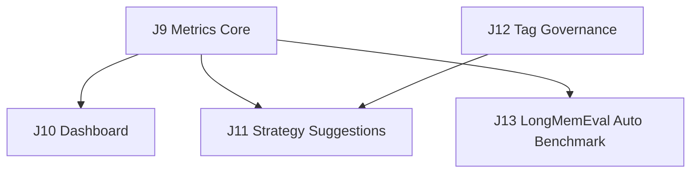

# wiki-mempalace 第三批 Issue / Task List

本文档承接 [roadmap.md](roadmap.md) 的下一阶段：完成 M10 metrics、M11 dashboard、M12 strategy，并并行推进 Schema T2 tag governance 和 LongMemEval 自动评测。

目标：

- 把当前 CLI health / doctor 的局部状态升级为统一指标层。
- 在指标稳定后提供最小只读运维面板。
- 基于 lint / gap / query / outbox 历史生成可解释策略建议。
- 补齐 `TagConfig` 已定义但未消费的标签治理主线。
- 建立自动但非 PR 必跑的 LongMemEval 评测链路。

## 当前状态

| 模块 | 状态 | 当前证据 | batch-3 要补什么 |
| --- | --- | --- | --- |
| M10 指标与评估 | 🔎 In Review / 已实现待 CI | 已有 `wiki-cli metrics`，支持 `--consumer-tag`、`--low-coverage-threshold`、`--json`、`--report <PATH>`；覆盖 content/lint/gaps/outbox/lifecycle 5 组指标；core/kernel/cli metrics 测试已补 | 模块 review、integration review、PR、CI |
| M11 运维控制台 | ⏳ 未完成 | 只有 CLI 运维面，无 dashboard | 最小只读 dashboard / HTML report |
| M12 策略层增强 | ⏳ 未完成 | 只有 lint/gap/fix 基础链路 | 自动 supersede / crystallize / stale 建议，不自动执行高风险写入 |
| Schema T2 标签治理 | ⏳ 未完成 | `TagConfig` 字段已存在，`Claim/Source/LlmClaimDraft` tags 与 ingest 策略未落地 | tags 模型、deprecated_tags 拦截、max_new_tags_per_ingest 限流 |
| LongMemEval 自动评测 | ⏳ 未完成 | 当前文档策略是不进必跑 CI，尚无自动 workflow / artifact 报告 | scheduled benchmark workflow、retrieval-only runner、artifact 报告 |

## Batch-3 总览

推荐并行方式：

- Agent A：J9 Metrics Core
- Agent B：J12 Tag Governance
- Agent C：J10 Dashboard（等 J9 接口稳定后启动）
- Agent D：J11 Strategy Suggestions（等 J9 基础指标和现有 gap/fix 输入稳定后启动）
- Agent E：J13 LongMemEval Auto Benchmark（等 J9 report 口径稳定后启动；可先独立做 retrieval-only）

同一轮避免多人同时大改 `crates/wiki-cli/src/main.rs`；若需要并行，先合入公共数据结构，再接 CLI 子命令。

## PRD / Spec 三件套

- PRD：[prd/batch-3.md](prd/batch-3.md)
- J9：[specs/m10-metrics/](specs/m10-metrics/)
- J10：[specs/m11-dashboard/](specs/m11-dashboard/)
- J11：[specs/m12-strategy/](specs/m12-strategy/)
- J12：[specs/schema-t2-tags/](specs/schema-t2-tags/)
- J13：[specs/longmemeval-auto/](specs/longmemeval-auto/)

---

## J9. Metrics Core

### 标题

`P2 / M10: 建立统一指标与评估层`

### 背景

当前系统已有 `automation health`、`automation doctor`、outbox stats、consumer progress、mempalace `kg_stats` 等局部状态，但没有统一指标口径，也没有能长期对比的 metrics 输出。

### 目标

新增一条统一 metrics 路径，让系统能回答“最近运行得怎么样”。

### 范围

- 定义 `WikiMetricsReport` 之类的指标结构。
- 汇总至少 5 类指标：
  - ingest / source / claim / page 规模
  - lint finding 数量与 severity 分布
  - gap finding 数量与 severity 分布
  - query / outbox / consumer backlog 状态
  - page lifecycle / promotion / stale 状态
- 新增 CLI：`wiki-cli metrics`。
- 支持文本输出；可选支持 `--json`。
- 可选写入 `wiki/reports/metrics-<timestamp>.md`。

### 建议 owner 范围

- `crates/wiki-core/`：指标数据结构。
- `crates/wiki-kernel/`：从 store / lint / gap 聚合指标。
- `crates/wiki-cli/`：CLI 输出、报告文件。
- `docs/roadmap.md` / 本文档：完成后回填。

### 交付物

- metrics 数据模型：已实现，进入 review。
- metrics 聚合函数：已实现，聚合 content/lint/gaps/outbox/lifecycle。
- `wiki-cli metrics` 命令：已实现。
- 文本输出、`--json`、`--report <PATH>`：已实现。
- 单元测试 + CLI 集成测试：core/kernel/cli metrics 初步通过，待 CI。

### 测试

- 单元测试：
  - 空库 metrics 输出稳定。
  - 有 source / claim / page 时规模计数正确。
  - lint / gap severity 分组正确。
  - outbox head / consumer backlog 计数正确。
- 集成测试：
  - CLI `metrics` 在临时 DB 上成功输出。
  - `--viewer-scope` 生效，不泄漏不可见文档。
  - 若支持 `--json`，输出可反序列化。
- 手工检查：
  - 一屏能看出 ingest、lint、gap、outbox、lifecycle 状态。

### 验收标准

- 至少 5 类核心指标可稳定查看：已实现，待 review/CI。
- 输出稳定到可被 dashboard / strategy 复用：已实现 JSON/report 入口，待后续模块消费验证。
- 指标不触发写入，默认只读：实现按只读聚合设计，待 review 确认。

### 风险

- 指标定义过宽，导致第一版难以收口。
- 反复运行 lint/gap 可能有额外成本。

### 回滚

- 保留 `automation health/doctor` 不变。
- metrics 第一版只读，不改变任何数据。

---

## J10. Dashboard

### 标题

`P2 / M11: 最小只读运维控制台`

### 背景

CLI 已能查看 health / doctor，但非开发者或长期运行时需要一个更集中的只读面板。M11 依赖 J9 的稳定指标输出。

### 目标

提供最小 dashboard，让操作者无需直接查 DB，就能看系统状态。

### 范围

- 新增 `wiki-cli dashboard` 或 `wiki-cli automation dashboard`。
- 第一版优先生成静态 HTML 或 Markdown report，不引入长期运行 Web server。
- 展示：
  - automation health
  - last failures
  - metrics summary
  - outbox / consumer backlog
  - mempalace consume status
  - P2 strategy suggestions 摘要入口（若 J11 已完成）

### 建议 owner 范围

- `crates/wiki-cli/`：命令与输出文件。
- `docs/automation-health-alerts.md`：补 dashboard 说明。

### 交付物

- dashboard 命令。
- 一个可打开的 HTML 或 Markdown 文件。
- 输出路径参数：`--output <PATH>`。
- CLI 集成测试。

### 测试

- 单元测试：
  - dashboard render 包含 health / metrics / backlog 区块。
  - red/yellow/green 状态文案稳定。
- 集成测试：
  - 临时 DB 生成 dashboard 文件。
  - 缺 palace DB 时仍能生成 wiki-only 面板。
- 手工检查：
  - 文件可读，状态一屏能判断。

### 验收标准

- 不进数据库也能快速判断系统健康。
- dashboard 默认只读。
- 没有新常驻服务依赖。

### 风险

- 第一版做成复杂 UI，拖慢 P2。

### 回滚

- 保留 CLI health/doctor/metrics 作为权威入口。
- dashboard 仅是渲染层，可直接停用。

---

## J11. Strategy Suggestions

### 标题

`P2 / M12: 自动策略建议层`

### 背景

系统已有 lint / gap / fix，但它们多是局部修复动作。M12 要把这些信号组合成更高层建议，例如“哪些 claim 可能需要 supersede”“哪些查询值得 crystallize”。

### 目标

新增只读策略建议，不自动执行高风险写入。

### 范围

- 新增策略建议模型，例如 `StrategySuggestion`。
- 首批至少 2 类建议：
  - `suggest.supersede_candidate`
  - `suggest.crystallize_candidate`
  - 可选：`suggest.stale_review`
- 新增 CLI：`wiki-cli strategy` 或 `wiki-cli suggest`.
- 输出 `code / severity / subject / reason / suggested_command`。
- 可选 `--write-page` 将建议写为 `EntryType::Synthesis` 或 `EntryType::LintReport` 页面。

### 建议 owner 范围

- `crates/wiki-core/`：建议数据结构。
- `crates/wiki-kernel/`：策略扫描。
- `crates/wiki-cli/`：CLI 输出。

### 输入信号

- lint findings。
- gap findings。
- query history / `QueryServed` outbox 事件。
- page status / stale / NeedsUpdate。
- claim supersede 链。
- metrics report（若 J9 已完成）。

### 交付物

- strategy suggestion 数据模型。
- 至少 2 类策略规则。
- CLI 命令。
- 文本输出，建议命令只作为提示，不自动执行。
- 测试覆盖每类规则。

### 测试

- 单元测试：
  - supersede candidate 规则触发和不触发。
  - crystallize candidate 规则触发和不触发。
  - severity / reason 稳定。
- 集成测试：
  - CLI 输出建议。
  - `--viewer-scope` 不泄漏不可见对象。
  - dry-run / 默认只读不改 store。
- 手工检查：
  - 建议不是噪音。
  - `suggested_command` 可复制执行。

### 验收标准

- 至少 2 类自动建议可进入日常使用。
- 默认不执行 supersede / crystallize。
- 输出足够解释“为什么建议做”。

### 风险

- 策略过激，误导用户改知识库。

### 回滚

- 第一版只读。
- 所有建议必须人工确认后另跑现有命令。

---

## J12. Schema T2 Tag Governance

### 标题

`Schema T2: 落地标签治理主线`

### 背景

`DomainSchema` 已有 `TagConfig`，包括 `deprecated_tags`、`allow_auto_extend`、`max_new_tags_per_ingest`、`orphan_threshold`、`dormant_threshold`。但当前模型和 ingest 流程未完整消费这些策略。

### 目标

补齐 tag 数据模型和 ingest 约束，让 schema 中的 tag config 不再只是静态字段。

### 范围

- 给 `LlmClaimDraft`、`Claim`、`Source` 补 `tags: Vec<String>`。
- ingest / ingest-llm / batch-ingest 保留或回填 tags。
- 消费 `TagConfig.deprecated_tags`。
- 消费 `TagConfig.max_new_tags_per_ingest`。
- 暂不实现 T3 的活跃度统计和自动扩展，只预留数据基础。

### 建议 owner 范围

- `crates/wiki-core/`：模型、serde default、schema 测试。
- `crates/wiki-kernel/`：ingest 路径 tags 归一与策略校验。
- `crates/wiki-cli/`：CLI/MCP 输出兼容。
- `docs/schema-followup-plan.md`：完成后回填 T2 状态。

### 交付物

- tags 字段向后兼容反序列化。
- tags 归一规则：trim、去空、去重、保持稳定顺序。
- deprecated tags 拦截或降级策略。
- max new tags 限流。
- 测试覆盖旧 snapshot、LLM plan、CLI ingest。

### 测试

- 单元测试：
  - 旧 JSON 无 tags 可反序列化为空数组。
  - tags 去重、去空、稳定排序或稳定保序。
  - deprecated tag 被拒绝或降级，错误信息清晰。
  - max_new_tags_per_ingest 生效。
- 集成测试：
  - `ingest-llm` 产物 tags 入库。
  - `batch-ingest` 不破坏 source frontmatter tags。
  - MCP `wiki_ingest_llm` 兼容 tags。
- 手工检查：
  - vault frontmatter 中 tags 可读。

### 验收标准

- Claim / Source / LlmClaimDraft 都有 tags。
- `TagConfig.deprecated_tags` 和 `max_new_tags_per_ingest` 被真实消费。
- 旧数据兼容，不需要迁移命令。

### 风险

- tags 写入影响旧 snapshot 兼容。
- LLM 输出 tags 噪音大。

### 回滚

- serde default 保持旧数据可读。
- 策略第一版可配置为 warning / drop，不默认破坏 ingest 主链路。

---

## J13. LongMemEval Auto Benchmark

### 标题

`P2 / M10+: LongMemEval scheduled benchmark lane`

### 背景

LongMemEval 是长期对话记忆评测，覆盖 information extraction、multi-session reasoning、knowledge updates、temporal reasoning、abstention。它适合评估长期记忆成熟度，但全量运行依赖外部数据、网络、可能的 LLM key 和较长耗时，不适合放进 PR 必跑 CI。

### 目标

建立自动化、非阻塞的 LongMemEval 评测链路：定时跑、产出 artifact、阈值告警，但不作为 branch protection required check。

### 范围

- 新增 scheduled GitHub Actions workflow：
  - nightly retrieval-only sample run
  - weekly full retrieval-only run
  - manual `workflow_dispatch`
- 新增本地 runner 脚本：
  - fetch dataset 到 `.cache/longmemeval/`
  - run retrieval-only benchmark
  - 输出 markdown / json report
- 第一版只做 retrieval-only：`R@1` / `R@5` / `MRR`。
- 预留 qa-judge 模式接口，但不在第一版默认启用。
- Dataset 不提交仓库；workflow 每次下载或使用 Actions cache。
- 报告作为 GitHub Actions artifact 上传。

### 建议 owner 范围

- `.github/workflows/`：scheduled workflow。
- `scripts/`：fetch / run 脚本。
- `docs/longmemeval.md`：自动评测策略。
- `docs/roadmap.md` / 本文档：完成后回填。

### 交付物

- `.github/workflows/longmemeval.yml`
- `scripts/longmemeval_fetch.py` 或 `.sh`
- `scripts/longmemeval_run.py` 或 `.sh`
- artifact：
  - `longmemeval-report.json`
  - `longmemeval-report.md`
  - `run-config.json`
- 阈值策略：
  - sample `R@5` 低于阈值时 workflow fail
  - MRR 相比基线下降超过阈值时 workflow fail（若有基线）

### 测试

- 单元测试：
  - report metric 计算正确。
  - 空结果 / 缺 expected session 时错误清晰。
  - runner config 解析正确。
- 集成测试：
  - 用小型 fixture 跑 retrieval-only，不访问外网。
  - workflow 脚本 dry-run 或 `bash -n` / Python compile 通过。
- 手工检查：
  - Actions artifact 可下载。
  - report 能看出样本数、R@1、R@5、MRR、失败 case。

### 验收标准

- PR CI 不跑 LongMemEval。
- nightly sample 自动跑并上传 artifact。
- weekly full retrieval-only 自动跑并上传 artifact。
- 失败能通过 Actions failure 暴露，但不阻塞普通 PR merge。
- dataset 和密钥不进入仓库。

### 风险

- 官方 dataset 更新导致结果漂移。
- 外部下载失败导致 scheduled run 噪音。
- qa-judge 成本和不确定性高。

### 回滚

- workflow 可 disable，不影响主 CI。
- runner 独立于业务代码。
- 第一版不接 qa-judge，避免 LLM key 成为硬依赖。

---

## Batch-3 模块完成统一检查清单

- 代码最小范围实现。
- 对应 CLI help / docs 更新。
- 单元测试覆盖核心规则。
- CLI 集成测试覆盖 happy path。
- 默认只读的功能必须确认无写入。
- 涉及 `--viewer-scope` 的输出必须测试隔离。
- 完成后回填 [roadmap.md](roadmap.md) 和本文档进度。

## 推荐执行顺序

1. J9 Metrics Core。
2. J12 Tag Governance 可与 J9 并行。
3. J10 Dashboard 等 J9 输出稳定后做。
4. J11 Strategy Suggestions 等 J9 基础指标稳定后做；若依赖 tags 信号，则等 J12 合入。
5. J13 LongMemEval Auto Benchmark 在 J9 report 口径稳定后启动；可先独立做 retrieval-only。

## Batch-3 完成标准

当且仅当以下条件同时满足，batch-3 才算完成：

1. `metrics` 能稳定输出至少 5 类核心指标。
2. dashboard/report 能用一个文件展示系统运行状态。
3. strategy/suggest 能输出至少 2 类可解释建议，且默认不执行高风险写入。
4. Schema T2 tags 已落地到模型与 ingest 主链路。
5. LongMemEval scheduled workflow 能自动产出 artifact，且不进入 PR required checks。
6. 所有新增命令有测试和文档。
7. `cargo test --workspace` 与 `cargo clippy --workspace --all-targets -- -D warnings` 通过。
