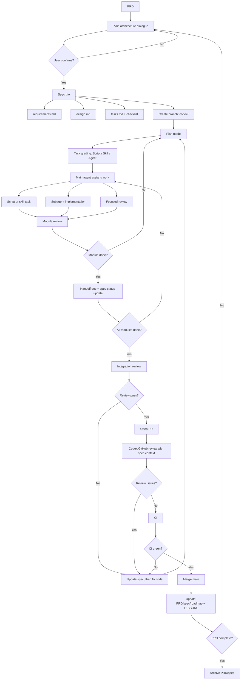

# Development Workflow

本文定义后续功能开发固定流程。目标：让新对话中的 agent 可从同一套 PRD / spec / review / PR 节奏接续，不靠会话记忆。

核心规则：

- PRD 是产品范围源。Agent 不主动改 PRD；如果范围需要变，先暂停并让用户决定。
- spec 三件套是实现源。代码和 spec 不一致时，先改 spec，再改代码。
- 每轮开发必须留下交接文档和经验记录，后续窗口只读文档即可接手。

## 流程图



## Gate Owners

用户介入 gate：

1. PRD approval。
2. Plain architecture approval。用户需要能用自己的话复述模块职责和模块关系。
3. Spec trio approval。
4. Plan approval。
5. Review decision for disputed findings。
6. PRD scope change decision。
7. Merge approval。
8. Next-module priority。

Agent 可自动处理：

- 开分支。
- subagent 分派。
- script / skill / subagent 分级执行。
- 小模块实现与 review。
- 整体 review。
- PR 创建。
- CI 查错与修复。
- 文档回填。

## Plain Architecture Dialogue

PRD 之后先做白话架构对话，不直接写技术 spec。

Agent 必须说明：

- 每个模块是什么，负责什么。
- 模块之间谁找谁要什么。
- 用户需要决定什么。
- 哪些范围不做。

用户确认后，再写 spec 三件套。确认标准：用户能复述每个模块的作用和模块之间的配合方式。

## Required Artifacts

每个 batch PRD：

- `docs/prd/<batch>.md`

每个功能模块：

- `docs/specs/<feature>/requirements.md`
- `docs/specs/<feature>/design.md`
- `docs/specs/<feature>/tasks.md`

每个 subagent 模块：

- `docs/handovers/<feature>/<module>.md`

每轮合并后：

- 更新 `docs/LESSONS.md`

每个 PR：

- GitHub PR 模板完整填写。
- `tasks.md` 勾选实现、测试、review、文档状态。
- `roadmap.md` 或 PRD 状态回填。
- 关联 spec 三件套和必要 handoff。

## Branch Rules

- 不直接在 `main` 开发。
- 分支名使用 `codex/<short-topic>`。
- 每个分支默认只承载一个模块；强相关模块必须在 PRD / spec 写明。
- 若工作树已有未提交改动，先确认属于当前任务，再开分支承接。

## Subagent Rules

- 复杂功能模块优先用 subagent 实现；简单机械任务不必强行启动 subagent。
- main agent 负责计划、分派、集成、review。
- subagent task 必须声明：
  - 目标。
  - owner files。
  - 不可触碰范围。
  - spec 片段和接口边界。
  - 测试要求。
  - 成功标准。
  - 失败停止条件。
  - 返回格式。
- 并行 subagent 不得同时拥有同一写入范围。
- subagent 完成后必须产出 handoff，只交回摘要，不把完整推理过程灌回 main agent。

## Task Grading

Plan mode 中先给每个 task 分级：

| Grade | 适用场景 | 执行方式 |
| --- | --- | --- |
| Script | 格式化、重命名、简单配置、批量机械改动 | main agent 直接用命令或脚本 |
| Skill | 有固定模式的文档、GitHub、review、CI 修复 | 调用对应 skill |
| Agent | 需要推理、设计取舍或跨文件实现 | 分派 subagent |

分级目的：减少不必要上下文成本，同时保留复杂模块的隔离。

## Review Rules

- 每个小模块完成后做 focused review。
- 全部模块完成后做 integration review。
- PR 打开后再做一次 Codex/GitHub review。
- review 必须对照 spec 三件套，不做无上下文盲审。
- review finding 处理规则：
  - P0/P1 必修。
  - P2 默认修，除非 PRD 明确延期。
  - P3 可排后续，但必须记录。
- 模块 review 不过，不开下一个复杂模块，先修当前模块。

## Spec Freshness

spec 三件套是活文档。

| 事件 | 操作 |
| --- | --- |
| subagent 完成模块 | 更新 tasks 状态和 checklist |
| 发现 spec 有误 | 先改 spec，再改代码 |
| review 发现遗漏 | 在 spec 补充，再新增 task |
| 整体 review 发现接口问题 | 修改 spec，重新拆受影响 tasks |
| 合并 main 后 | 标记完成，必要时归档 |

PRD 不同。PRD 是产品范围源，Agent 不能自行改。需要改 PRD 时，先暂停并让用户决定。

## Handoff Rules

handoff 必须自包含，任何新窗口只读 spec 片段 + handoff 就能接手。

必须包含：

- 改动摘要。
- 修改文件。
- 暴露接口。
- 已知限制。
- 新增依赖。
- 测试结果。
- spec / checklist 状态。
- 下一步建议。

模板见 [templates/module-handoff.md](templates/module-handoff.md)。

## Lessons

每轮 merge 后更新 [LESSONS.md](LESSONS.md)。

记录：

- 哪些 spec 写法导致返工。
- 哪些模块拆分有效。
- 哪些测试或 review 抓到了问题。
- 下轮 Plan mode 应提前注意什么。

## CI Rules

必跑：

```bash
cargo fmt --all -- --check
cargo test --workspace
cargo clippy --workspace --all-targets -- -D warnings
```

脚本新增时至少跑：

```bash
bash -n scripts/<script>.sh
python -m py_compile scripts/<script>.py
```

LongMemEval 不作为 PR required check；只走 scheduled / manual workflow，并上传 artifact。
