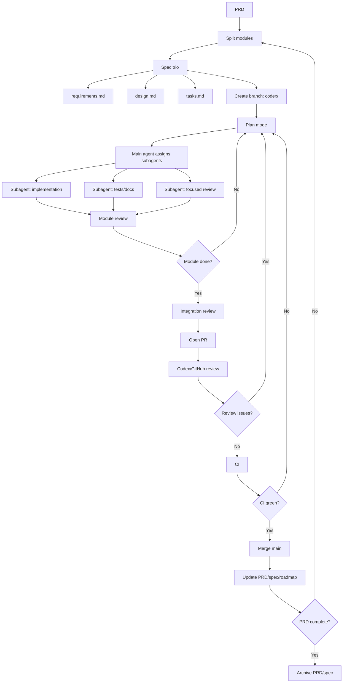

# Development Workflow

本文定义后续功能开发固定流程。目标：让新对话中的 agent 可从同一套 PRD / spec / review / PR 节奏接续，不靠上下文记忆。

## 流程图



## Gate Owners

用户介入 gate：

1. PRD approval。
2. Spec trio approval。
3. Plan approval。
4. Review decision for disputed findings。
5. Merge approval。
6. Next-module priority。

Agent 可自动处理：

- 开分支。
- subagent 分派。
- 小模块实现。
- 小模块 review。
- 整体 review。
- PR 创建。
- CI 查错与修复。
- 文档回填。

## Required Artifacts

每个 batch PRD：

- `docs/prd/<batch>.md`

每个功能模块：

- `docs/specs/<feature>/requirements.md`
- `docs/specs/<feature>/design.md`
- `docs/specs/<feature>/tasks.md`

每个 PR：

- GitHub PR 模板完整填写。
- `tasks.md` 勾选实现、测试、review、文档状态。
- `roadmap.md` 或 PRD 状态回填。

## Branch Rules

- 不直接在 `main` 开发。
- 分支名使用 `codex/<short-topic>`。
- 每个分支默认只承载一个模块；强相关模块必须在 PRD / spec 写明。
- 若工作树已有未提交改动，先确认属于当前任务，再开分支承接。

## Subagent Rules

- 每个功能模块优先用 subagent 实现。
- main agent 负责计划、分派、集成、review。
- subagent task 必须声明：
  - 目标。
  - owner files。
  - 不可触碰范围。
  - 测试要求。
  - 返回格式。
- 并行 subagent 不得同时拥有同一写入范围。

## Review Rules

- 每个小模块完成后做 focused review。
- 全部模块完成后做 integration review。
- PR 打开后再做一次 Codex/GitHub review。
- review finding 处理规则：
  - P0/P1 必修。
  - P2 默认修，除非 PRD 明确延期。
  - P3 可排后续，但必须记录。

## CI Rules

必跑：

```bash
cargo fmt --all -- --check
cargo test --workspace
cargo clippy --workspace --all-targets -- -D warnings
```

脚本新增时至少跑：

```bash
bash -n scripts/<script>.sh
python -m py_compile scripts/<script>.py
```

LongMemEval 不作为 PR required check；只走 scheduled / manual workflow，并上传 artifact。
