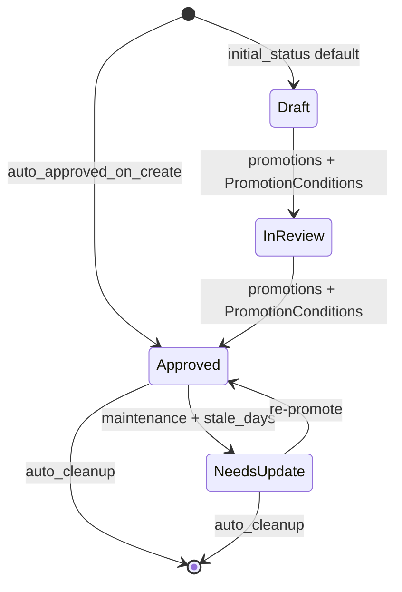
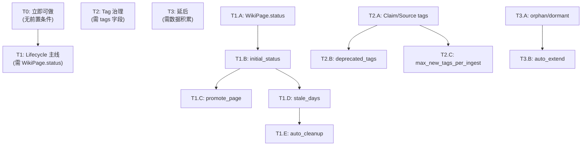

# Schema 后续项开发路线图

> 基于 `crates/wiki-core/src/schema.rs` 中已定义但尚未被消费的 schema 字段，
> 按前置依赖和 ROI 分为 T0 / T1 / T2 / T3 四层。

---

## 设计裁决

- `EntryStatus` 仅挂在 **WikiPage** 上；Claim 维持 `MemoryTier` + `stale: bool` 不动。
- `LifecycleRule.stale_days` 语义：`auto_cleanup = false` → 标记 `NeedsUpdate`；`auto_cleanup = true` → 从 store 删除。
- 现有 `Cmd::Promote { claim_id }` 是 claim tier 晋升，不破坏；T1 新增独立的 `Cmd::PromotePage`。
- 向前兼容全靠 `#[serde(default)]`，不写数据迁移命令。

## EntryStatus 状态机



---

## Tier 分级总览



---

## T0 -- 立即可做，无前置条件

| # | 功能 | Schema 入口 | 实现挂点 | 完成判据 |
|---|------|-------------|----------|----------|
| T0.1 | `wiki schema validate` 子命令 | `DomainSchema::validate()` | `wiki-cli/main.rs` 新增 `Cmd::SchemaValidate` | 合法 json exit 0，非法 exit 1 + 具体错误 |
| T0.2 | `--entry-type` 扩档到 Crystallize | `EntryType` | `Cmd::Crystallize` + MCP `wiki_crystallize` | crystallize 创建的 page 带正确 entry_type + 触发 lint |

---

## T1 -- Lifecycle 主线全闭环

> 前置：T1.A WikiPage.status 字段

| # | 功能 | Schema 入口 | 实现挂点 | 完成判据 |
|---|------|-------------|----------|----------|
| T1.A | WikiPage 加 `status: EntryStatus` | `EntryStatus` 枚举 | `wiki-core/page.rs` | 旧 json 反序列化默认 Draft，新 page 默认 Draft |
| T1.B | 创建时自动设 initial_status | `LifecycleRule.initial_status` + `EntryType::auto_approved_on_create()` | `wiki-kernel/engine.rs` + CLI/MCP 三处 page 创建 | Summary/QA 自动 Approved，Concept/Entity 走 rule |
| T1.C | `wiki promote-page` 命令 | `PromotionRule` + `PromotionConditions`（全 4 字段） | `wiki-kernel/engine.rs` + `Cmd::PromotePage` | 条件不满足报错，满足则 status 变更 |
| T1.D | Maintenance 消费 `stale_days`（非 cleanup） | `LifecycleRule.stale_days` + `auto_cleanup: false` | `wiki-kernel/engine.rs` + `Cmd::Maintenance` | 过期 page 标记 NeedsUpdate，计数输出 |
| T1.E | Maintenance 消费 `auto_cleanup` | `LifecycleRule.stale_days` + `auto_cleanup: true` | `wiki-kernel/engine.rs` + `Cmd::Maintenance` | 过期 page 从 store 删除，发事件，计数输出 |

### T1.C PromotePage 条件检查明细

`PromotionConditions` 四字段逐一校验：

| 字段 | 检查逻辑 | 数据来源 |
|------|----------|----------|
| `min_age_days` | `now - page.updated_at >= min_age_days` | `WikiPage.updated_at` |
| `required_sections` | page markdown 中包含全部指定段落标题 | 现有 lint section 抽取逻辑 |
| `min_references` | 被 summary 的 mention-page 引用次数 >= N | `WikiPage.outbound_page_titles` 反查 |
| `cooldown_days` | 自上次状态变更后冷却 >= N 天 | `WikiPage.updated_at` |

### T1.D stale_days 流程

```
maintenance 调用 mark_stale_pages(now, schema)
  → 遍历 lifecycle_rules 中 stale_days = Some(d) && auto_cleanup == false
  → 对每个 page：entry_type 匹配 && status != NeedsUpdate && now - updated_at > d天
  → 置 status = NeedsUpdate，发事件
  → 返回计数
```

### T1.E auto_cleanup 流程

```
maintenance 调用 cleanup_expired_pages(now, schema)
  → 遍历 lifecycle_rules 中 stale_days = Some(d) && auto_cleanup == true
  → 对每个 page：entry_type 匹配 && now - updated_at > d天
  → 从 store.pages 移除，发 PageDeleted 事件
  → 返回计数
```

---

## T2 -- Tag 治理主线

> 前置：需先给 `LlmClaimDraft`、`Claim`、`Source` 模型补 `tags: Vec<String>` 字段。
> 本次不实施，单独规划。

| # | 功能 | Schema 入口 | 实现挂点 | 完成判据 |
|---|------|-------------|----------|----------|
| T2.A | 数据模型补 tags 字段 | - | `model.rs` / `llm_ingest_plan.rs` | Claim/Source/LlmClaimDraft 有 tags 字段 |
| T2.B | `deprecated_tags` 拦截 | `TagConfig.deprecated_tags` | `ingest` / `auto_hooks` | 使用废弃标签时报错或降级 |
| T2.C | `max_new_tags_per_ingest` 限流 | `TagConfig.max_new_tags_per_ingest` | `ingest` 流程 | 超限截断或报错 |

---

## T3 -- 延后项

> 需要真实数据积累后才有意义。

| # | 功能 | Schema 入口 | 备注 |
|---|------|-------------|------|
| T3.A | `orphan_threshold` / `dormant_threshold` 标签活跃度 | `TagConfig.orphan_threshold` / `dormant_threshold` | 需足够 tag 使用数据 |
| T3.B | `allow_auto_extend` 标签自动扩展 | `TagConfig.allow_auto_extend` | 需 T2 先完成 |
| T3.C | `Claim.status: EntryStatus` | `LifecycleRule` | 当前 Claim 用 stale: bool，暂不升级 |

---

## 当前进度

- [x] T0.1 `wiki schema validate` 子命令
- [x] T0.2 `--entry-type` 扩档到 Crystallize
- [ ] T1.A WikiPage.status 字段
- [ ] T1.B initial_status 解析
- [ ] T1.C promote_page 命令
- [ ] T1.D stale_days 消费
- [ ] T1.E auto_cleanup 消费
