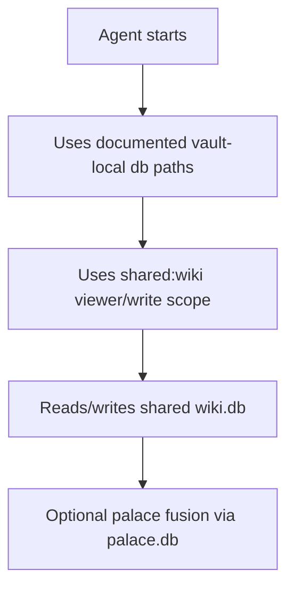

# Design: Agent Runtime Defaults

## Summary

Standardize the production run path around vault-local DBs and `shared:wiki`.

## Plain-Language Design

- Module role: operator guide and guardrail.
- Data it asks for: B1-B3 command names and flags.
- Data it returns: exact daily commands and optional safer defaults.

## Data Model / Interfaces

- Canonical runtime tuple:
  - `--wiki-dir /Users/mac-mini/Documents/wiki`
  - `--db /Users/mac-mini/Documents/wiki/.wiki/wiki.db`
  - `--palace-db /Users/mac-mini/Documents/wiki/.wiki/palace.db` or command
    equivalent
  - `--viewer-scope shared:wiki`
  - write scope `shared:wiki`
- MCP write tools allow explicit `scope`; when omitted, they use the MCP server
  `--viewer-scope`.

## Flow

## Edge Cases

- Agent omits scope; write uses server `--viewer-scope`, normally
  `shared:wiki`.
- Agent omits `--db` and uses repo-root `wiki.db`.
- Multiple terminals run commands concurrently.
- User needs private notes later.

## Compatibility

- Keep explicit private scopes available.
- Do not change existing command-line overrides.
- Docs should favor explicit flags even if code defaults improve.

## Spec Sync Rules

- If B4 changes code defaults, update requirements and tests.
- If default scope remains explicit-only, docs must say so directly.

## Test Strategy

- Unit/integration: if code defaults change, cover default resolution.
- Docs check: commands use vault-local `.wiki/` paths and `shared:wiki`.
- Manual: start MCP with documented command.
