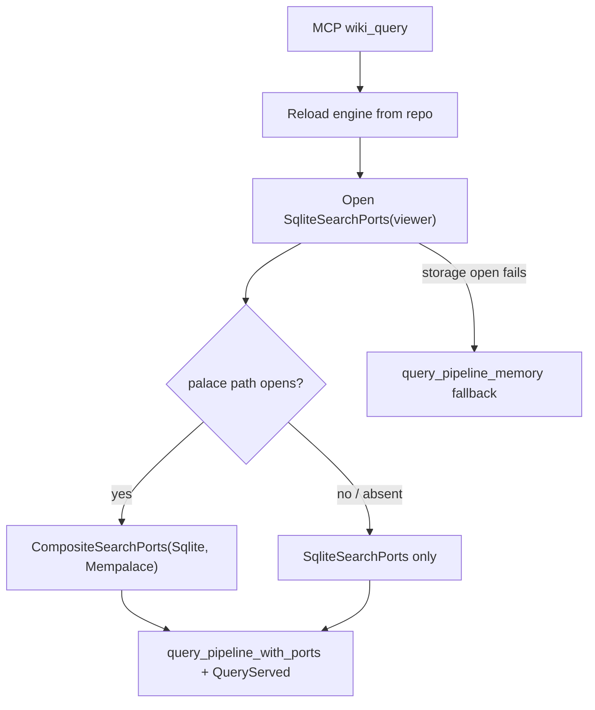

# Design: Audit Disposition PR1 MCP Query Storage Ports

## Summary

`wiki-cli query` already prefers `SqliteSearchPorts`; MCP `wiki_query` still used
`query_pipeline_memory`. This module moves MCP to the same storage-backed default.

## Plain-Language Design

- Module role: build the right query ports inside MCP before running `wiki_query`.
- Data it asks for: `wiki.db` repo snapshot, server viewer scope, optional palace path.
- Data it returns: the same ranked result JSON as before.

## Data Model / Interfaces

- No new public MCP args.
- No result schema change.
- Internal helper reloads engine from repo before query so `QueryServed` persistence saves a fresh snapshot.

## Flow

## Edge Cases

- Storage reload/open failure: log warning to stderr, use old in-memory query path.
- Palace open failure: log warning to stderr, keep wiki-only storage search.
- Stale MCP memory: reload before query prevents later save from overwriting persisted rows.
- `write_page=true`: page insertion happens after query and is saved with the fresh store.

## Compatibility

- JSON-RPC method, input schema, result shape, and typed errors stay compatible.
- Mempalace bank remains derived from server viewer scope.
- `InMemorySearchPorts` remains as fallback/test support.

## Test Strategy

- Unit/integration: MCP handler tests for persisted-only query, invalid palace fallback, write_page projection.
- Regression: QueryServed outbox still contains query hash event.
- Full gate: workspace fmt/test/clippy/deny.
