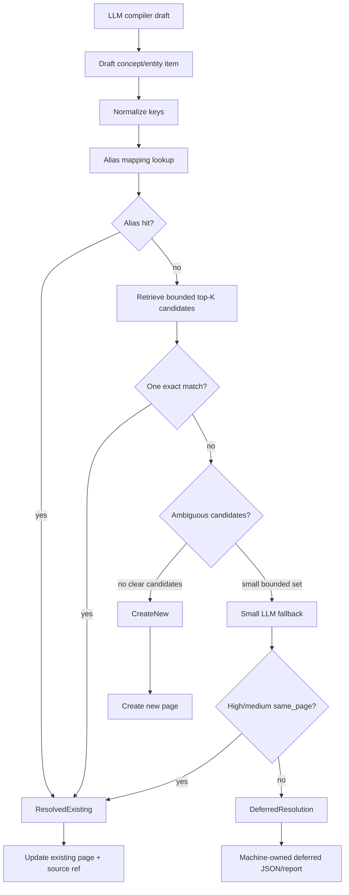

# Design: Compiler Canonicalization v2

## Summary

Replace the current in-code alias fallback with a resolver layer used by
`batch-ingest` before concept/entity page writes. The resolver returns canonical
decisions from normalized keys, persisted alias data, bounded DB candidates, and
a small LLM fallback when deterministic checks are ambiguous.

## Plain-Language Design

- `WikiCompilerRunner` still owns source compilation.
- The main LLM still reads the article and emits a draft plan.
- A new resolver reads only DB-backed page metadata and alias data.
- The resolver decides target page ID/title/type for each draft item.
- The page writer only creates/updates pages from resolver decisions.

## Data Model

### Alias Mapping

Add a durable mapping for accepted aliases:

```text
alias_text
normalized_alias_key
canonical_page_id
canonical_title
entry_type
scope
source
confidence
created_at
updated_at
```

Implementation can store this in SQLite and expose it through a repository
method. The compiler does not need to serialize alias mappings into
`wiki_state`; `wiki.db` is still the canonical source.

### Candidate

```text
page_id
title
entry_type
scope
aliases
excerpt
score
match_reasons
```

The excerpt must be short and bounded. It exists only for resolver decisions and
LLM fallback prompts.

### Resolution

```text
ResolvedExisting { page_id, title, entry_type, confidence, reason }
CreateNew { title, entry_type, confidence, reason }
DeferredResolution { title, entry_type, candidates, reason }
```

Only `ResolvedExisting` and safe `CreateNew` may reach the page writer.
`DeferredResolution` is machine-owned: it does not create/update active graph
pages, and it is emitted as structured run data for later lint/fixer passes.

## Interfaces

### Storage

Add repository helpers for alias mappings:

- `upsert_canonical_alias(mapping)`
- `find_canonical_alias(scope, alias_key)`
- `list_canonical_aliases_for_pages(page_ids)`

SQLite table/indexes should support scope + normalized alias lookup and page ID
lookup.

### Compiler Resolver

The compiler module should expose internal helpers:

- normalize title into stable comparison keys,
- build one draft item from `LlmConceptDraft`/`LlmEntityDraft`,
- retrieve bounded candidates,
- resolve deterministic matches,
- call optional LLM fallback,
- persist safe alias decisions.

### LLM Fallback

System prompt contract:

```text
You decide if one draft wiki item and one of the candidate wiki pages are the
same canonical page. Return only JSON.
```

Input contains:

- draft title,
- draft type,
- draft definition/profile,
- top-K candidates:
  - title,
  - type,
  - aliases,
  - short excerpt.

Output:

```json
{
  "same_page": true,
  "canonical_title": "MCP 协议",
  "confidence": "high",
  "reason": "same protocol; connector wording is alias"
}
```

Only `same_page=true` with high/medium confidence and a candidate title may
resolve to existing page. Low confidence becomes `DeferredResolution`.

## Flow



## Candidate Retrieval

Candidate retrieval ranks only pages in current scope whose entry type is
`concept` or `entity`.

Scoring:

- exact normalized title key,
- exact compact title key,
- alias mapping hit,
- requested repo-name normalization hit,
- body/wikilink contains compact key,
- preferred entry type match,
- cross-type fallback penalty.

Top-K default: 5. Tests may assert the bound. The bound can be a private
constant in this PR.

## Resolver Policy

- Exact alias mapping hit wins.
- Exact single candidate in preferred type wins.
- Exact single candidate in concept/entity cross-type wins.
- Multiple exact or fuzzy candidates require bounded LLM fallback or
  machine-deferred output.
- No clear candidate creates a new page with normalized output title.
- Low-confidence LLM decision becomes machine-owned deferred output and does not
  create a page.
- Source references remain deduped by summary title/source URL.

## Post-Write Lint/Fixer Contract

This PR does not need to implement a full duplicate fixer. It must document and
preserve the apply order:

```text
wiki.db -> Vault projection -> Mempalace sync -> audit
```

Any future fixer command must reject direct Vault/palace mutation as source of
truth.

## Compatibility

- `batch-ingest` remains public entrypoint.
- Existing compiler output page contracts stay unchanged.
- Existing `--dry-run` remains read-only.
- Existing claim/entity/relationship writes continue unless resolver blocks
  unsafe page materialization.
- Existing tests that prove page materialization should be updated to use
  resolver data instead of hardcoded aliases.

## Test Strategy

- Unit:
  - title normalization,
  - alias key persistence lookup,
  - candidate scoring and top-K bound,
  - concept/entity cross-type fallback,
  - low-confidence machine-deferred output,
  - LLM fallback JSON parsing,
  - source reference dedup.
- Integration:
  - fake X source resolves `MCP connectors` to `MCP 协议`,
  - fake WeChat source resolves `MCP连接器` to same page,
  - ambiguous candidates skip unsafe duplicate creation,
  - dry-run does not write DB/Vault.
- Regression smoke:
  - temporary vault/DB only,
  - use X + WeChat tiny-sample-shaped fixtures,
  - do not mutate `/Users/mac-mini/Documents/wiki`.

## Spec Sync Rules

- If implementation changes resolver result shape, update this design before
  code.
- If storage mapping changes schema materially, update requirements and tasks.
- If production smoke is requested later, record explicit user approval and
  commands in handoff.
