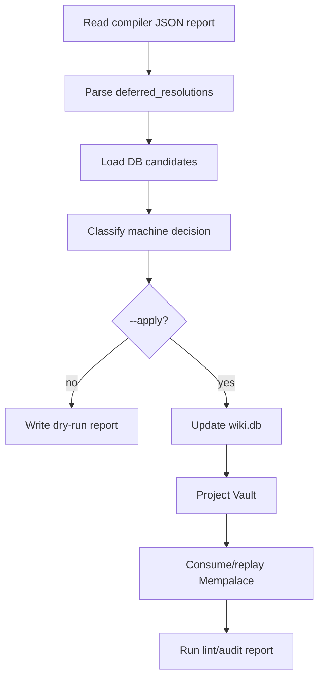

# Design: Compiler Deferred Resolution Agent

## Summary

Add CLI pass that reads compiler `deferred_resolutions`, applies safe
machine-only decisions to `wiki.db`, then refreshes projections and audit.

## CLI

```bash
compiler-resolve-deferred --report <json> [--apply] [--allow-create] [--report-dir <path>]
```

Uses global flags:

```text
--db --wiki-dir --sync-wiki --viewer-scope --palace
```

Default mode is dry-run.

## Decision Model

```text
AliasExisting {
  deferred_id,
  alias,
  canonical_page_id,
  confidence,
  reason
}

CreateCanonical {
  deferred_id,
  title,
  entry_type,
  confidence,
  reason
}

IgnoreNoise {
  deferred_id,
  reason
}

KeepDeferred {
  deferred_id,
  candidates,
  confidence,
  reason
}
```

## Policy

- Exact existing canonical or durable alias hit -> `AliasExisting`.
- Candidate `page_id` is the preferred identity. Title/type fallback is allowed
  only for legacy reports and only when unique in the active scope.
- Clear safe miss -> `CreateCanonical` only with `--allow-create`.
- Boilerplate, empty, navigation, or duplicate artifact -> `IgnoreNoise`.
- Ambiguous/low-confidence -> `KeepDeferred`.
- No human/manual queue.

## Apply Flow



## Reports

Write structured JSON plus concise Markdown under `--report-dir` or default
report location. Include input report path, dry-run/apply mode, decision counts,
and per-item reason.

## Regression

- Use temp vault/DB/palace only.
- Fixtures: X + WeChat deferred reports.
- Regression must fail on `page.broken_wikilink`.
- Real `/Users/mac-mini/Documents/wiki` requires explicit user approval.

## Spec Sync

If implementation changes decision names, CLI flags, or apply order, update
requirements and tasks before code.
