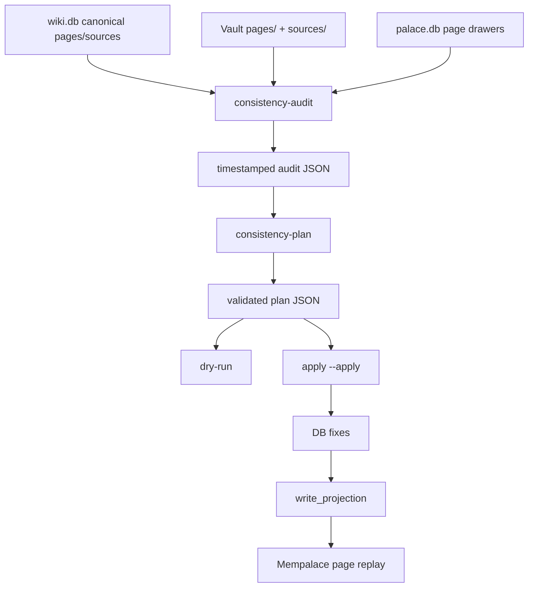

# Design: DB/Vault/Palace Consistency Governance

## Summary

The feature adds a new CLI family:

```bash
wiki-cli --db <wiki.db> --wiki-dir <vault> --palace <palace.db> consistency-audit
wiki-cli --wiki-dir <vault> consistency-plan --audit-report <audit.json>
wiki-cli --db <wiki.db> --wiki-dir <vault> --palace <palace.db> consistency-apply --plan <plan.json> [--apply]
```

`wiki.db` remains the source. Vault and Mempalace are checked as projections.

## Data Flow



## Report Shape

Audit JSON contains:

- `version`, `generated_at`, `db_path`, `wiki_dir`, `palace_path`
- `db`: page/source counts, known IDs, known projection paths
- `vault`: managed/missing/extra files, empty unmanaged files, stale links,
  unresolved local links, source orphan candidates
- `palace`: page drawer counts, missing page drawers, stale page drawers,
  source drawer policy note
- `candidates`: exact source-summary matches and safe cleanup candidates

Plan JSON contains:

- `version`, `generated_at`, `audit_report_path`, `actions`
- action `kind`: `db_fix`, `vault_cleanup`, `palace_replay`, `needs_human`,
  `deferred`
- executable action payloads are narrow and typed.

## Apply Rules

- Validate the full plan before the first write.
- `db_fix` edits DB records through storage/repository APIs.
- After DB writes, call existing projection code so Vault files are regenerated
  from DB state.
- `vault_cleanup` only removes unmanaged empty files or approved stale report
  files listed in the plan and audit.
- `palace_replay` uses the same page materialization path as `palace-init` /
  live sink. Direct SQL against `palace.db` is forbidden.
- Mempalace audit/replay only expects page types accepted by the live sink:
  `summary`, `concept`, `entity`, `synthesis`, and `qa`.
- Source drawer creation remains out of scope.

## Interfaces And Ownership

- Main CLI wiring lives in `crates/wiki-cli/src/main.rs`.
- New consistency logic should live in `crates/wiki-cli/src/consistency.rs`.
- Palace page replay should reuse `wiki-mempalace-bridge` traits instead of
  duplicating palace table writes.
- Existing `vault-audit`, `orphan-governance`, and `palace-init` behavior must
  remain backward-compatible.

## Failure Modes

- Missing `--db` fails audit/apply.
- Missing `--wiki-dir` fails all consistency commands.
- Missing `--palace` skips palace audit but records that it was skipped.
- Plan schema/path validation failure aborts before any write.
- Any DB write failure aborts before Vault projection and Mempalace replay.
- Any Mempalace replay failure is reported after DB/Vault success; no direct
  rollback of DB is attempted.

## Tests

- Unit tests for audit path classification and timestamped report names.
- Unit tests for plan validation and path injection rejection.
- Unit tests for dry-run no-op.
- Integration-style tests for apply order with fake DB/Vault/Palace adapters.
- CLI tests for `consistency-audit`, `consistency-plan`, and dry-run
  `consistency-apply`.
