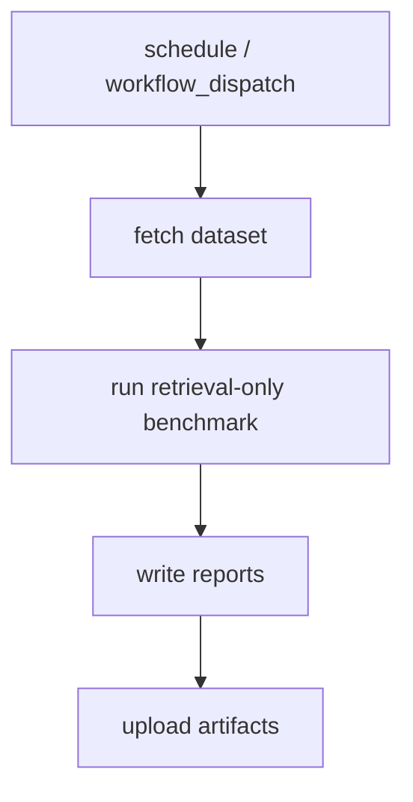

# Design: LongMemEval Auto Benchmark

## Summary

- Build independent benchmark lane around retrieval-only evaluation.

## Data Model / Interfaces

- Runner config: dataset variant, sample size, mode, thresholds.
- Report JSON: metrics, cases, failures.

## Flow

## Edge Cases

- Dataset download fails.
- Dataset schema changes.
- No API keys.
- Empty retrieval results.

## Compatibility

- No required CI check.
- No repo-tracked dataset.
- Can disable workflow without affecting main CI.

## Test Strategy

- Unit: metric calculation.
- Integration: local tiny fixture.
- Workflow: script syntax / Python compile.
