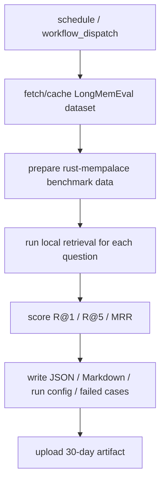

# Design: LongMemEval Auto Benchmark

## Summary

- Build an independent benchmark lane around `rust-mempalace` retrieval-only
  evaluation.
- J13 is a scheduled exam for local long-term memory retrieval. It checks
  whether the expected memory appears in the returned results and how high it
  ranks.
- J13 does not use external embedding, LLM judging, or `wiki-cli` semantic
  fusion. Those belong to the deferred J14 benchmark.

## Data Model / Interfaces

- Runner config:
  - dataset path and dataset variant;
  - sample size;
  - run mode: nightly sample or weekly full;
  - top-k values;
  - reference thresholds;
  - timeout settings;
  - git commit and runner version.
- Report JSON:
  - generated_at;
  - run mode;
  - sample count;
  - R@1, R@5, MRR;
  - total runtime seconds;
  - average query latency milliseconds;
  - throughput per second;
  - timeout count;
  - failed cases.
- Failed cases:
  - case id;
  - query;
  - expected memory id or reference id;
  - returned top ids;
  - short snippets only.

## Flow

## Schedule

GitHub Actions cron uses UTC:

- Nightly sample: `0 19 * * *`, which is 03:00 Asia/Shanghai.
- Weekly full: `0 20 * * 6`, which is Sunday 04:00 Asia/Shanghai.

The workflow also supports manual `workflow_dispatch` with mode and sample-size
inputs for debugging.

## Artifact Contract

- `longmemeval-report.json` is the machine-readable source of truth.
- `longmemeval-report.md` is generated from the same data for humans.
- `run-config.json` records what was tested and how.
- `failed-cases.jsonl` is optional but recommended when failures exist.
- Artifacts are uploaded with `retention-days: 30`.

Retrieval scores below reference thresholds should appear in the report, but
should not fail the workflow. Broken runs fail the workflow so missing reports
are visible.

## Edge Cases

- Dataset download fails.
- Dataset schema changes.
- Empty retrieval results.
- No benchmark cases after filtering.
- A single case times out.
- Weekly full run exceeds the configured timeout.

## Compatibility

- No required CI check.
- No repo-tracked dataset.
- Can disable workflow without affecting main CI.
- No `pull_request` trigger.
- No changes to existing `ci-quick.yml` or `ci-mempalace-e2e.yml`.

## Test Strategy

- Unit: metric calculation.
- Integration: local tiny fixture.
- Workflow: script syntax / Python compile.
- Report contract: JSON parse and Markdown generation from fixture output.

## J14 Boundary

J14 should be a separate module named Semantic Fusion Benchmark. It compares
the J13 local baseline with a semantic fusion lane such as
`wiki-cli query --vectors --palace-db`.

J14 should wait until J13 has enough reports to show whether semantic search is
needed and how much runtime budget is available. Suggested gate:

- 7 valid nightly reports.
- 1 valid weekly full report.
- Known weekly full runtime.
- Artifact format stable.
- If weekly full runtime is 15 minutes or less, J14 may add both nightly and
  full semantic runs.
- If weekly full runtime is 15 to 45 minutes, J14 should start with sample
  semantic runs only.
- If weekly full runtime is above 45 minutes, optimize J13 before starting J14.
