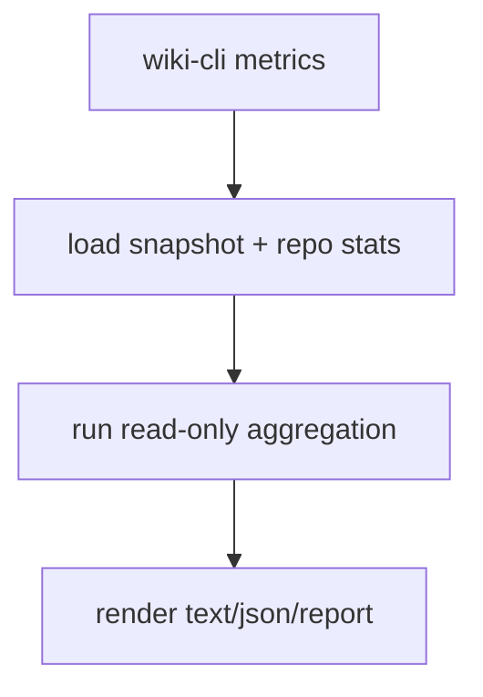

# Design: M10 Metrics Core

## Summary

- Create a read-only `WikiMetricsReport` aggregation path.
- CLI renders report without changing store.

## Data Model / Interfaces

- `WikiMetricsReport`
- `ContentMetrics`
- `LintGapMetrics`
- `OutboxMetrics`
- `LifecycleMetrics`
- Optional `render_metrics_text()` / `render_metrics_markdown()`

## Flow

## Edge Cases

- Empty DB.
- Missing consumer progress.
- No wiki dir for report write.
- Viewer scope hides private docs.

## Compatibility

- No schema migration required unless persistent metrics history is added later.
- Does not change automation health / doctor behavior.

## Test Strategy

- Unit: aggregation and render helpers.
- Integration: CLI metrics with temp DB.
- Manual: run against local dogfood DB.
