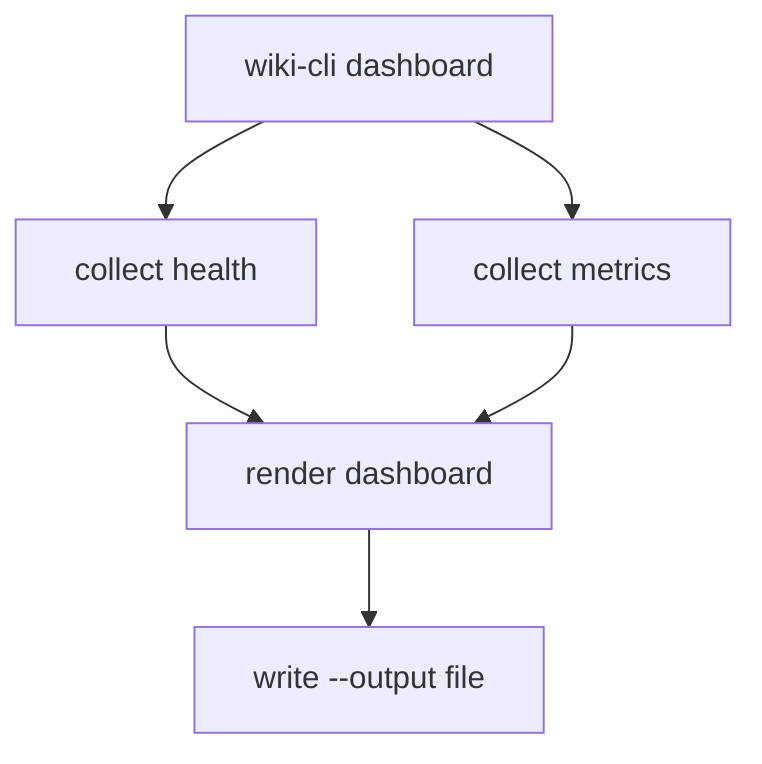

# Design: M11 Dashboard

## Summary

- Thin render layer over J9 metrics and existing automation health.

## Data Model / Interfaces

- Reuse `WikiMetricsReport`.
- Reuse automation health report.
- Add dashboard render fn returning string.

## Flow

## Edge Cases

- Missing output dir.
- No metrics available because J9 not wired.
- Red/yellow status should be visible in plain text.

## Compatibility

- Dashboard is optional and read-only.

## Test Strategy

- Unit: render sections.
- Integration: temp DB output file.
- Manual: open generated file.
