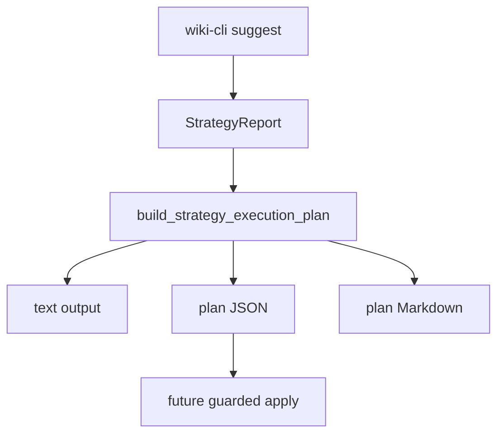

# Design: M12 Executor Dry-Run Planner

## Summary

The planner sits after M12 `StrategyReport` generation. It maps every
suggestion to a typed dry-run action and writes optional plan artifacts. It does
not execute writes.

## Flow



## Data Model

- `StrategyExecutionPlan`
  - `plan_id`
  - `source_report_id`
  - `generated_at`
  - `viewer_scope`
  - `mode = dry_run`
  - `actions`
- `StrategyExecutionAction`
  - `action_id`
  - `suggestion_id`
  - `code`
  - `subject`
  - `execution_policy`
  - `action_kind`
  - `dry_run_status`
  - `command_preview`
  - `suggestion_reason`
  - `reason`

## Mapping

- Allowlisted `suggest.fix_auto_safe` command preview -> `fix_auto_safe` +
  `would_apply`.
- Other `auto_safe` suggestions -> `unsupported` + `blocked`.
- `agent_review` -> `agent_review` + `blocked`.
- `human_required` -> `human_required` + `blocked`.

## CLI Behavior

- `wiki-cli suggest`: unchanged.
- `wiki-cli suggest --executor-plan`: prints the normal suggestion text and a
  dry-run plan summary.
- `wiki-cli suggest --json --executor-plan`: prints:

```json
{
  "strategy_report": {},
  "executor_plan": {}
}
```

- `wiki-cli suggest --report-dir --executor-plan`: writes existing suggestion
  report siblings plus `*-executor-plan.json` and `*-executor-plan.md`.

## Compatibility

- Existing `StrategyReport` JSON is unchanged when `--executor-plan` is absent.
- Existing report filenames are unchanged.
- Plan Markdown is rendered from plan JSON data and names its sibling JSON.

## Test Strategy

- Core unit tests for plan serialization and policy mapping.
- CLI integration tests for JSON envelope and report-dir sibling writes.
- Existing read-only `suggest` tests continue to protect default behavior.
