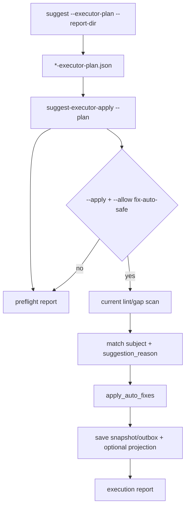

# Design: M12 Executor Guarded Apply

## Summary

Add `wiki-cli suggest-executor-apply` as the guarded executor entrypoint. It
reads a prior dry-run plan, validates typed actions against current auto fixes,
and only writes when both `--apply` and an explicit allowlist are present.

## Flow



## Command

```bash
wiki-cli suggest-executor-apply \
  --plan wiki/reports/suggestions/<id>-executor-plan.json \
  --allow fix-auto-safe \
  --apply
```

Flags:

- `--plan <PATH>`: required plan JSON.
- `--allow fix-auto-safe`: repeatable allowlist. Only this value exists now.
- `--apply`: required for writes.
- `--json`: print execution report JSON.
- `--report-dir [PATH]`: write execution JSON/Markdown siblings.

## Safety Model

- The command never parses or executes `command_preview`.
- `fix_auto_safe` apply is allowed only when:
  - plan action status is `would_apply`;
  - plan action kind is allowlisted;
  - plan has a subject and `suggestion_reason`;
  - current lint/gap auto fix still matches the same subject and reason.
- Old dry-run plans lacking `suggestion_reason` are blocked and must be
  regenerated.
- Duplicate action signatures are skipped.

## Report Model

`StrategyExecutorApplyReport` is CLI-local and serializes:

- `report_id`
- `plan_id`
- `source_report_id`
- `generated_at`
- `mode`: `preflight` or `apply`
- `apply_requested`
- `allowlist`
- `summary`
- `actions`

Each action reports `status`: `would_apply`, `applied`, `blocked`, or `skipped`.

## Compatibility

- Existing `fix --write --auto-only` remains unchanged.
- Existing `suggest` default and dry-run planner output remain compatible; this
  PR only adds `suggestion_reason` to future plan actions, with serde default for
  older plan JSON.

## Test Strategy

- CLI integration: preflight does not write.
- CLI integration: `--apply` requires allowlist.
- CLI integration: allowlisted apply mutates only matching auto fixes.
- Workspace tests and clippy.
