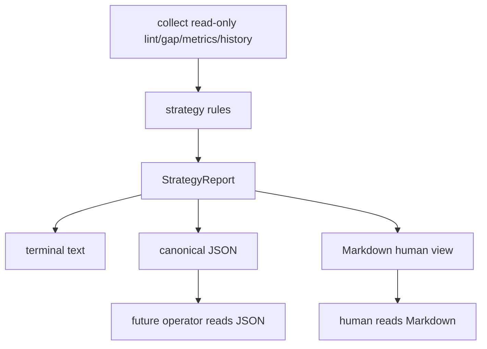
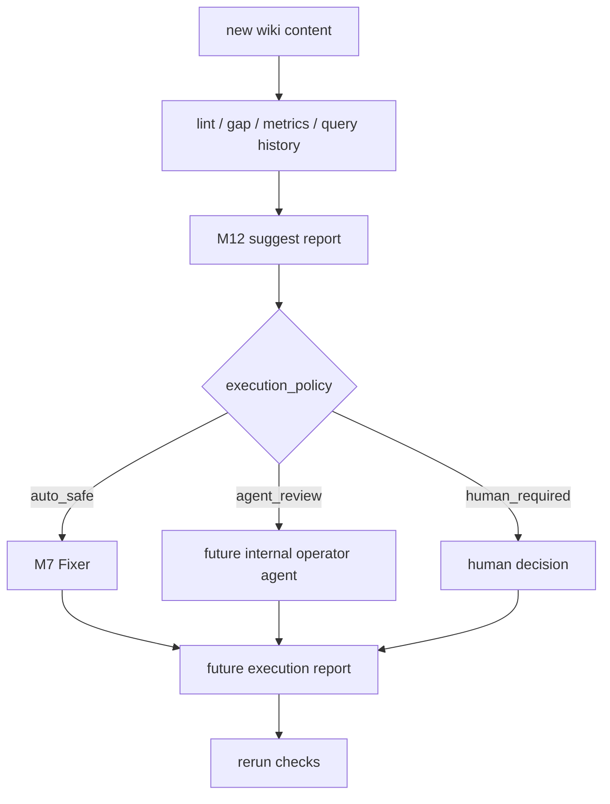

# Design: M12 Strategy Suggestions

## Summary

- Add read-only strategy scanner that maps existing signals into suggestions.
- Add durable suggestion reports for agents and humans.
- Keep execution outside M12 first version.

## Data Model / Interfaces

- `StrategySuggestion`
- `StrategySeverity`
- `StrategyExecutionPolicy`
- `StrategyReport`
- `run_strategy_scan(...)`
- `render_strategy_report_text(...)`
- `render_strategy_report_markdown(...)`

## Flow

## Business Flow

M12 first version stops at `M12 suggest report`.

## Read-Only Signal Sources

- Use read-only collectors such as `collect_basic_lint_findings`,
  `run_gap_scan`, and `collect_wiki_metrics`.
- Query history must come from stored outbox/export data, not by running a new
  query pipeline.
- `QueryServed.query_fingerprint` is treated as potentially raw query text.
  Because current events do not store scope, M12 may only use a query event when
  its `top_doc_ids` can be resolved through the current store and pass
  `doc_id_visible_to_viewer`-equivalent checks for the current viewer.
- If query event visibility cannot be proven, skip the query event. Do not print
  the query text in JSON, Markdown, or `suggested_command`.
- Do not call write/audit paths while scanning:
  - `eng.run_basic_lint(...)`
  - `eng.query_pipeline_memory(...)`
  - `eng.record_query(...)`
  - `run_fix_job(...)`
- Report artifact writes are allowed only for explicit output files.

## Edge Cases

- No history.
- Duplicate suggestions.
- Private scope leakage.
- Suggested command references missing entity.
- JSON/Markdown drift.
- Report filename collisions.
- Suggestions that look executable but require deletion or disputed semantic
  replacement.
- Query history events with empty, stale, unresolvable, or mixed-scope
  `top_doc_ids`.

## Compatibility

- No new writes by default.
- Report file writes are explicit artifacts only; they do not write DB, outbox,
  or projection.
- `--write-page` is out of scope for first version.
- Execution report format is reserved for a later internal operator module.

## Report Format

- `StrategyReport` owns:
  - `report_id`
  - `generated_at`
  - `viewer_scope`
  - `suggestions`
- `StrategySuggestion` owns:
  - `suggestion_id`
  - `code`
  - `severity`
  - `subject`
  - `reason`
  - `suggested_command`
  - `execution_policy`
- JSON serialization is canonical.
- Markdown is rendered from the same in-memory `StrategyReport`.
- Markdown header includes `report_id`, `generated_at`, suggestion count, and
  sibling JSON filename.

## Execution Policy Mapping

- `FixActionType::Auto` can map to `auto_safe`.
- `FixActionType::Draft` maps to `agent_review`.
- `FixActionType::Manual` maps to `agent_review` only when the action is
  non-deletion and evidence is explicit; otherwise it maps to `human_required`.
- Any delete, discard, force, cleanup, cross-scope merge, or disputed semantic
  replacement must map to `human_required`.

## Test Strategy

- Unit: each rule triggers / does not trigger.
- Integration: CLI output and viewer scope.
- Unit: Markdown render uses the same report data as JSON fixture.
- Integration: report files are timestamped and both formats share report id.
- Integration: default run is read-only against DB, outbox, and projection.
- Integration: query-history suggestions do not include hidden or unresolved
  `QueryServed` events.
- Manual: inspect noise level on dogfood DB.
