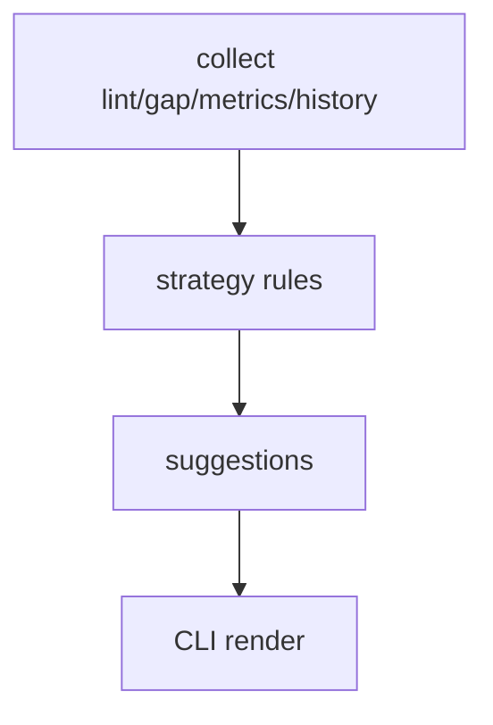

# Design: M12 Strategy Suggestions

## Summary

- Add read-only strategy scanner that maps existing signals into suggestions.

## Data Model / Interfaces

- `StrategySuggestion`
- `StrategySeverity`
- `run_strategy_scan(...)`

## Flow

## Edge Cases

- No history.
- Duplicate suggestions.
- Private scope leakage.
- Suggested command references missing entity.

## Compatibility

- No new writes by default.
- Can add `--write-page` later or in same module only if scoped as optional.

## Test Strategy

- Unit: each rule triggers / does not trigger.
- Integration: CLI output and viewer scope.
- Manual: inspect noise level on dogfood DB.
