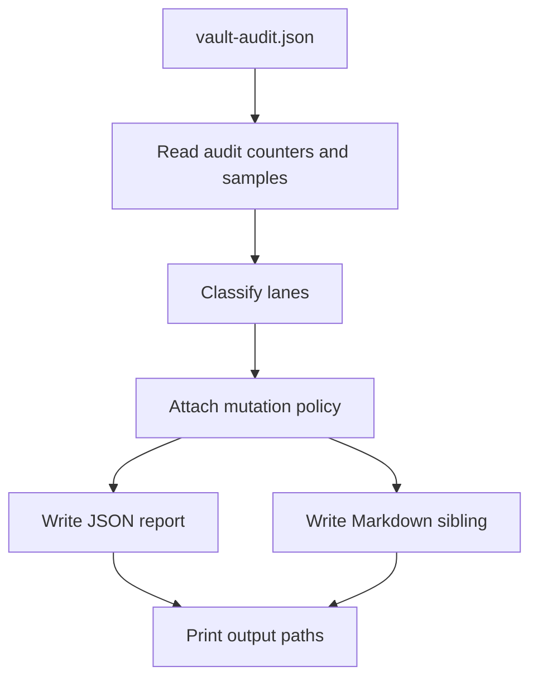

# Design: B5 Orphan Governance

## Summary

B5 is a read-only reporting module. It consumes the fresh production
`vault-audit.json`, turns high-level audit counters into governance lanes, and
writes JSON/Markdown reports. It does not mutate vault content.

## Plain-Language Design

- Module role: traffic controller for risky cleanup.
- Data it asks for: one audit JSON report.
- Data it returns: a governance report saying which findings are safe to only
  report, which could later be automated, and which require human judgment.

Current classification:

| Audit finding | Count | Lane | Reason |
| --- | ---: | --- | --- |
| Orphan candidates | 4 | `human_required` | Samples are old `.wiki` / `_archive` / legacy Markdown. Move/delete/link decisions need human context. |
| Unsupported frontmatter | 12 | `agent_review` | Current report exposes count, not exact paths. Need path-level evidence before fix. |
| Pages missing `status` | 5 | `future_auto_fix` | Future dry-run can propose `status: draft`, but v1 must not write it. |
| Sources missing `compiled_to_wiki` | 16 | `agent_review` | `true` vs `false` changes ingestion semantics. Need per-source evidence. |

## Data Model / Interfaces

New module:

- `crates/wiki-cli/src/orphan_governance.rs`

CLI:

```bash
cargo run -p wiki-cli -- \
  --wiki-dir /Users/mac-mini/Documents/wiki \
  orphan-governance \
  --audit-report /Users/mac-mini/Documents/wiki/reports/vault-audit.json
```

Output files:

- JSON: `<report-dir>/orphan-governance-report.json`
- Markdown: `<report-dir>/orphan-governance-report.md`

Rust report shape:

- `OrphanGovernanceReport`
  - `generated_at`
  - `audit_report_path`
  - `vault_path`
  - `counts`
  - `lanes`
  - `mutation_policy`
- `GovernanceCounts`
  - `orphan_candidates`
  - `unsupported_frontmatter`
  - `pages_missing_status`
  - `sources_missing_compiled_to_wiki`
- `GovernanceLane`
  - `lane`
  - `finding`
  - `count`
  - `samples`
  - `reason`
  - `next_step`

## Flow



## Edge Cases

- Audit report is missing required fields.
- Audit report uses older schema where readiness counters are absent.
- `--report-dir` points outside `<wiki-dir>/reports`.
- Audit path is not under the vault reports directory.
- Counts are zero; still write an empty governance report.

## Compatibility

- Does not affect B1-B4.
- Does not require DB, outbox, or palace.
- Uses the same vault-relative report path rule as other Agent-facing report
  commands.

## Spec Sync Rules

- If B5 grows an apply mode, update PRD/spec first and wait for user approval.
- If `vault-audit` later adds path-level arrays for missing `status` /
  `compiled_to_wiki`, update this spec before enabling auto-fix dry-run.

## Test Strategy

- Unit:
  - parse audit JSON and classify 4/12/5/16 counts.
  - render JSON and Markdown reports.
  - reject report dirs outside `<wiki-dir>/reports`.
- CLI:
  - `orphan-governance --audit-report ...` writes both files.
  - no non-report vault Markdown file changes.
- Workspace:
  - `cargo fmt --all -- --check`
  - `cargo test -p wiki-cli --test orphan_governance`
  - `cargo test -p wiki-cli --test vault_cli_commands`
  - `cargo test --workspace`
  - `cargo clippy --workspace --all-targets -- -D warnings`
