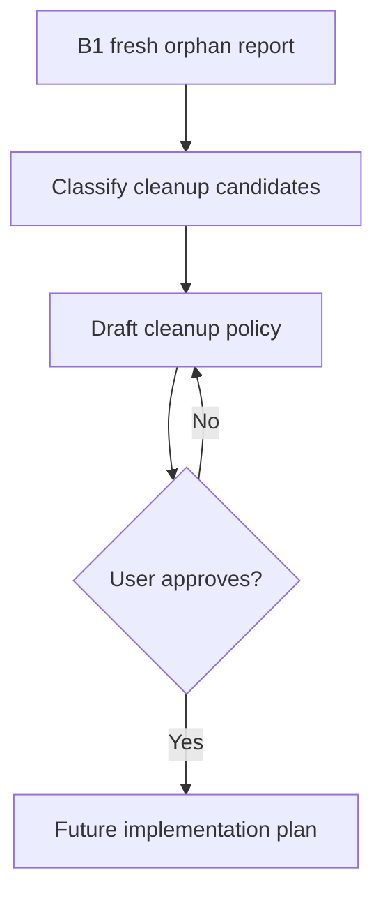

# Design: Orphan Governance

## Summary

B5 is a deferred planning module. It exists now so B1 reports the right data,
but implementation waits for current evidence.

## Plain-Language Design

- Module role: cleanup planner.
- Data it asks for: B1 orphan report.
- Data it returns: safe cleanup policy and follow-up tasks.

## Data Model / Interfaces

- Input report categories come from B1, not old `.wiki/orphan-audit.json`.
- Output plan should classify actions:
  - report only
  - low-risk link candidate
  - recompile candidate
  - metadata repair candidate
  - manual review required

## Flow

## Edge Cases

- Old orphan report disagrees with fresh audit.
- A source has title match in multiple pages.
- A source is compiled true but summary is missing.
- A source has malformed metadata.

## Compatibility

- Does not affect B1-B4.
- Does not change vault until separately approved.

## Spec Sync Rules

- If B5 grows into implementation inside this batch, update PRD and wait for
  user approval.

## Test Strategy

- Planning phase: no tests beyond report consistency.
- Future implementation: dry-run and mutation tests required.
