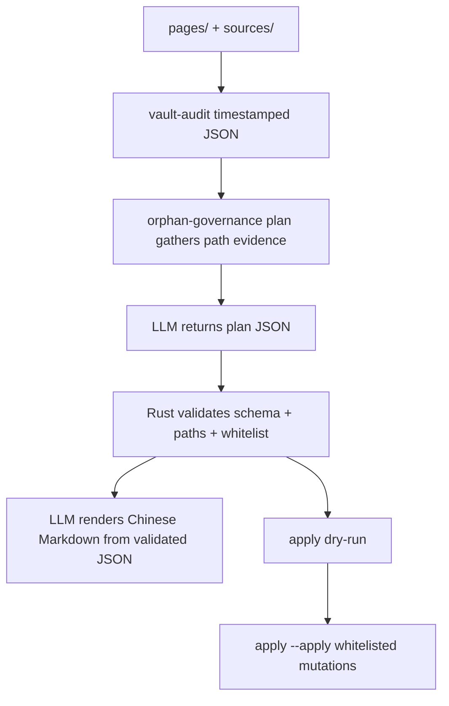

# Design: B5 Orphan Governance Follow-up

## Summary

B5 follow-up has three commands/flows:

1. `vault-audit` creates a timestamped, path-level audit from real content.
2. `orphan-governance plan` asks the LLM for a validated governance plan.
3. `orphan-governance apply` executes only whitelisted actions from that plan.

LLM decides and writes Chinese explanation. Rust code validates and executes.

## Interfaces

Audit:

```bash
cargo run -p wiki-cli -- vault-audit \
  --vault /Users/mac-mini/Documents/wiki
```

Output:

- `reports/vault-audit-<timestamp>.json`
- `reports/vault-audit-<timestamp>.md`

Plan:

```bash
cargo run -p wiki-cli -- --wiki-dir /Users/mac-mini/Documents/wiki \
  --llm-config llm-config.toml \
  orphan-governance plan \
  --audit-report /Users/mac-mini/Documents/wiki/reports/vault-audit-<timestamp>.json
```

Output:

- `reports/orphan-governance-plan-<timestamp>.json`
- `reports/orphan-governance-plan-<timestamp>.md`

Apply:

```bash
cargo run -p wiki-cli -- --wiki-dir /Users/mac-mini/Documents/wiki \
  orphan-governance apply \
  --plan /Users/mac-mini/Documents/wiki/reports/orphan-governance-plan-<timestamp>.json
```

Add `--apply` to mutate.

## Data Flow



## Governance Plan Shape

Plan JSON contains:

- `version`
- `generated_at`
- `audit_report_path`
- `vault_path`
- `audit_generated_at`
- `actions`
- `markdown_report_model`

Each action contains:

- `action_type`: `insert_page_status` |
  `insert_source_compiled_to_wiki` | `delete_cleanup_path` | `needs_human` |
  `recommend_batch_ingest`
- `path`
- `value`
- `confidence`
- `reason`
- `source`: `rule` or `llm`

Only the first three action types are executable. `recommend_batch_ingest` is a
next-step note only.

## LLM Boundaries

- LLM receives compact evidence: paths, frontmatter summaries, source titles,
  summary title candidates, and rule pre-classification.
- LLM returns JSON only for planning.
- Rust rejects any LLM action if:
  - path is not in audit/path evidence or cleanup whitelist
  - action type is not recognized
  - executable action is outside whitelist
  - confidence is missing
  - value is invalid
- Chinese Markdown is generated only after plan JSON passes validation.

## Root Concepts Bug

`write_projection` already has a regression test for root `concepts/`. The
follow-up must broaden coverage to the CLI sync path that users actually run
and keep cleanup from hiding the write-back bug.

## Tests

- Audit fixture with `.wiki`, `_archive`, `reports`, root `concepts`,
  `pages`, and `sources`.
- Timestamped audit output only.
- Plan rejects undated audit file names.
- Fake LLM responses validate/reject path injection.
- Dry-run apply leaves files unchanged.
- Apply inserts only frontmatter fields and deletes only cleanup whitelist.
- CLI/sync regression: no root `concepts/` file appears after sync.
