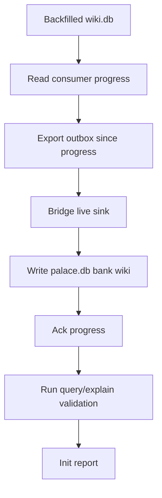

# Design: Palace Init

## Summary

Use the existing bridge consumption path where possible, adding only the missing
bootstrap/reporting behavior needed for a backfilled corpus.

## Plain-Language Design

- Module role: palace builder.
- Data it asks for: wiki outbox and resolver access to `wiki.db`.
- Data it returns: `palace.db` plus validation results.

## Data Model / Interfaces

- Input events come from `wiki_outbox`.
- Consumer tag defaults to `mempalace`.
- Viewer scope defaults to `shared:wiki`.
- Palace bank should resolve to `wiki`.
- Init report includes:
  - consumed event counts
  - ignored/filtered/unresolved counts
  - drawer count
  - kg fact count
  - query/explain smoke results

## Flow

## Edge Cases

- Missing `palace.db`.
- Existing partially populated `palace.db`.
- Outbox contains unsupported event types.
- Resolver cannot resolve a referenced item.
- Scope mismatch filters expected records.
- No claims exist yet.

## Compatibility

- Keeps current outbox consumer progress semantics.
- Keeps ignored event behavior for unsupported event types.
- Uses existing fusion path from `query/explain --palace-db`.

## Spec Sync Rules

- If palace needs new event types from B2, update B2 and this design before
  implementation.

## Test Strategy

- Unit: report counters if new report model exists.
- Integration: temp wiki db -> consume -> temp palace db -> query/explain.
- Manual: run against vault-local db after limited backfill.
