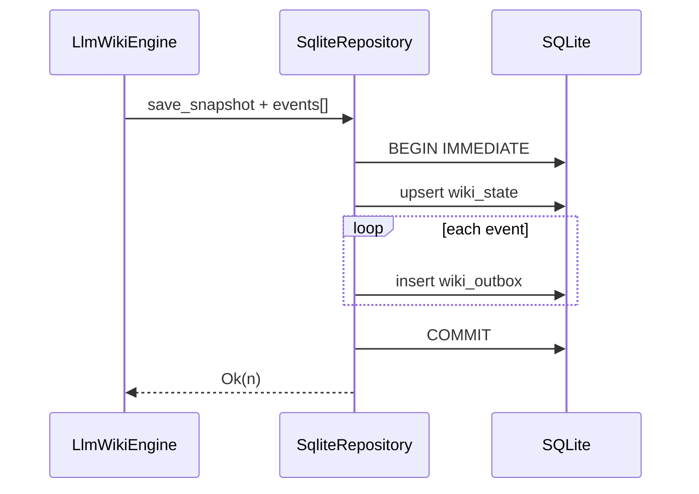

# Design: Atomic Snapshot + Outbox Persistence

## Summary

- Introduce a **single transaction** that wraps:
  1. `INSERT … ON CONFLICT` into `wiki_state` (snapshot)
  2. `INSERT` into `wiki_outbox` for each event in the flush batch

## Constraints

- `WikiRepository` is currently `&self` on all methods; `rusqlite::Connection::transaction`
  requires `&mut self`. **Chosen design: A**.

- **A (implemented)**: Add `WikiRepository::save_snapshot_and_append_outbox(
    &self, snapshot, events: &[WikiEvent])` using `execute_batch` with
    `BEGIN IMMEDIATE` / `COMMIT` / `ROLLBACK` (same pattern as
  `mark_outbox_processed`), keeping `&self` and avoiding a mutable
  `Connection` handle.
- B (`with_sqlite_tx`) was not chosen because it would leak SQLite-specific
  transaction control into engine/CLI call sites.
- C (default sequential trait method) was not chosen because it would allow
  non-atomic implementations to satisfy the API silently.

- **In-memory / mock repos**: `#[cfg(test)]` or `InMemoryStore` may implement
  “atomic” as sequential updates without a real DB; tests must assert behavior
  matches SQLite semantics for ordering.

## Interface Sketch (non-binding)

```text
// WikiRepository
fn save_snapshot_and_append_outbox(
    &self,
    snapshot: &StorageSnapshot,
    events: &[WikiEvent],
) -> Result<usize, StorageError>;
```

- Returns number of outbox rows inserted.
- On any error, entire batch rolls back; snapshot reverts with it.

## Engine Integration

- Add `LlmWikiEngine::save_to_repo_and_flush_outbox_with_policy<R>` as the
  production write path for callers that need snapshot + outbox. It serializes
  the current snapshot, passes the full in-memory outbox to
  `save_snapshot_and_append_outbox`, and clears the in-memory outbox only after
  success.

- **C15 compatibility**: legacy `flush_outbox_to_repo_with_policy` remains for
  explicit outbox-only use, but CLI/MCP save+flush paths use the atomic method.
  With a single transaction, “partial failure” becomes “whole transaction
  failed” and nothing commits.

## Flow



## Edge Cases

- **Empty outbox, snapshot only**: still one transaction (snapshot-only) or
  allow fast path `save_snapshot` only — spec allows either; document choice.
- **Very large outbox batch**: this implementation commits the full current
  in-memory outbox in one transaction. If this becomes too large, a future spec
  must explicitly weaken the contract to “per chunk atomicity”.
- **WAL + readers**: `BEGIN IMMEDIATE` is appropriate to avoid write starvation.

## Compatibility

- Existing DBs: no schema migration; only call-site and API changes.
- Downgrade: older binaries still open DB; new binary writes are still valid rows.

## Test Strategy

- Unit/integration: real temp `wiki.db` with a test trigger that fails
  `wiki_outbox` insert after the snapshot upsert; assert the previous snapshot
  remains visible and no outbox row is committed.

## Spec Sync Rules

- If `WikiRepository` gains a new method, update all implementors in one PR.
