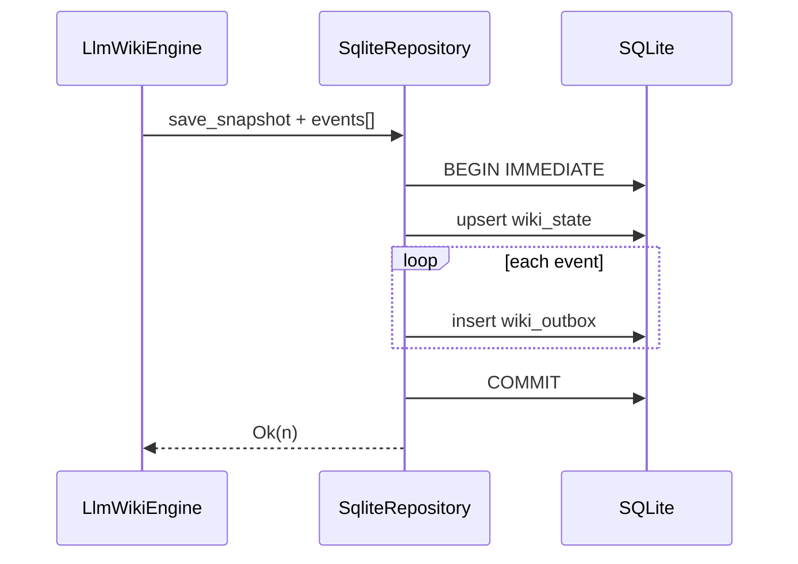

# Design: Atomic Snapshot + Outbox Persistence

## Summary

- Introduce a **single transaction** that wraps:
  1. `INSERT … ON CONFLICT` into `wiki_state` (snapshot)
  2. `INSERT` into `wiki_outbox` for each event in the flush batch

## Constraints

- `WikiRepository` is currently `&self` on all methods; `rusqlite::Connection::transaction`
  requires `&mut self`. **Design choice** (pick one in implementation, document here):

  - **A (preferred)**: Add `SqliteRepository::save_snapshot_and_outbox_in_transaction(
    &self, snapshot, events: &[WikiEvent])` using `execute_batch` with
    `BEGIN IMMEDIATE` / `COMMIT` / `ROLLBACK` (same pattern as
    `mark_outbox_processed`), keeping `&self` and avoiding a mutable
    `Connection` handle if possible; or
  - **B**: Expose a connection-scoped `with_sqlite_tx` only on `SqliteRepository`
    (not on trait) and migrate call sites, or
  - **C**: Extend `WikiRepository` with a default trait method that is only
    implemented for SQLite with interior mutability (not ideal).

- **In-memory / mock repos**: `#[cfg(test)]` or `InMemoryStore` may implement
  “atomic” as sequential updates without a real DB; tests must assert behavior
  matches SQLite semantics for ordering.

## Interface Sketch (non-binding)

```text
// SqliteRepository
pub fn save_snapshot_and_append_outbox(
    &self,
    snapshot: &StorageSnapshot,
    events: &[WikiEvent],
) -> Result<usize, StorageError>;
```

- Returns number of outbox rows inserted.
- On any error, entire batch rolls back; snapshot reverts with it.

## Engine Integration

- Add `LlmWikiEngine::save_to_repo_with_outbox<R>` or reimplement
  `save_to_repo` + `flush_outbox_to_repo_with_policy` as a single call into
  `save_snapshot_and_append_outbox` when both are needed, **or** keep
  `flush` logic but have it call the batched storage API with `&self.outbox[range]`
  and clear in-memory outbox only after success.

- **C15 fix preserved**: on partial `append` failure, engine must still trim
  successfully written events; with a single transaction, “partial failure”
  becomes “whole transaction failed” and nothing commits — **simpler** invariants,
  but tests must check no duplicate on retry of the same in-memory outbox
  (same as today).

## Flow



## Edge Cases

- **Empty outbox, snapshot only**: still one transaction (snapshot-only) or
  allow fast path `save_snapshot` only — spec allows either; document choice.
- **Very large outbox batch**: may need chunking with **one transaction per
  chunk**; if so, R1 in requirements must be rephrased to “per chunk atomicity”
  and document ordering across chunks.
- **WAL + readers**: `BEGIN IMMEDIATE` is appropriate to avoid write starvation.

## Compatibility

- Existing DBs: no schema migration; only call-site and API changes.
- Downgrade: older binaries still open DB; new binary writes are still valid rows.

## Test Strategy

- Unit: mock failure after snapshot SQL, before first outbox insert → no row
  in `wiki_state` from that attempt (or full rollback visible).
- Integration: real temp `wiki.db`, `std::fs` / injected hook to fail second
  `execute` if the codebase supports it; otherwise use SQLite
  `PRAGMA compile_options` and savepoints in test-only code path.

## Spec Sync Rules

- If `WikiRepository` gains a new method, update all implementors in one PR.
