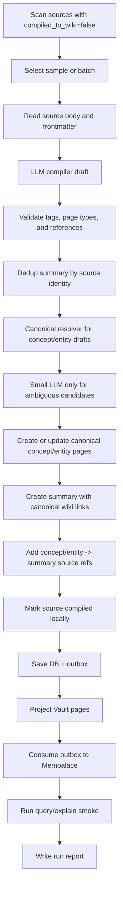

# Design: Production Wiki Compiler

## Summary

Create an internal `WikiCompilerRunner` and move `batch-ingest` onto it. The
runner compiles source Markdown into the Notion-equivalent output contract:
summary plus visible concept/entity pages with bidirectional references.

## Plain-Language Design

- Module role: compile raw source articles into human-visible wiki entries.
- Data it asks for: source article body/frontmatter, existing wiki pages,
  existing concept/entity names, LLM output.
- Data it returns: compile stats, generated/updated page ids, skipped reasons,
  and a run report.

## Data Model / Interfaces

### LLM Output

The compiler needs a richer plan than current `LlmIngestPlanV1` materializes.
The implementation can extend the existing plan or introduce a compiler-specific
plan type, but it must contain:

- summary:
  - title,
  - one-sentence summary,
  - 3-5 key insights,
  - confidence,
  - wiki tags,
  - personal note.
- concepts:
  - canonical name,
  - kind: `concept`,
  - definition,
  - key points,
  - tags,
  - related concept names.
- entities:
  - canonical name,
  - kind: `entity`,
  - entity category,
  - definition/profile,
  - key points,
  - tags,
  - related concept/entity names.
- source metadata:
  - author,
  - publisher,
  - published_at,
  - external URL.

### Compiler Runner

Internal runner responsibilities:

- scan candidate source files,
- select tiny sample or limited batch,
- call LLM,
- validate plan,
- deduplicate summary targets,
- resolve concept/entity drafts to canonical pages before writing,
- write DB pages through `LlmWikiEngine`,
- write/update managed Vault pages through projection-compatible paths,
- update source `compiled_to_wiki`,
- append outbox through existing repository save path,
- emit a report.

### CLI Surface

Keep `batch-ingest` as the compatible entrypoint.

Add only the minimum flags needed for the production sample:

- `--origin <x|wechat|all>` to constrain source origin.
- `--scope <SCOPE>` to avoid hardcoded `private:batch-ingest` for production.
- `--source-id <UUID>` or `--source-path <PATH>` for exact sample selection.
- Existing `--limit`, `--dry-run`, and `--delay-secs` remain.

Default production command shape:

```bash
cargo run -p wiki-cli -- \
  --db /Users/mac-mini/Documents/wiki/.wiki/wiki.db \
  --wiki-dir /Users/mac-mini/Documents/wiki --sync-wiki \
  --viewer-scope shared:wiki \
  batch-ingest \
  --vault /Users/mac-mini/Documents/wiki \
  --scope shared:wiki \
  --origin x \
  --limit 1
```

## Flow



## Canonical Resolver v2

The compiler should stay focused on understanding the article. It produces a
draft list of summary, concepts, entities, relationships, and tags. The resolver
decides whether each draft concept/entity maps to an existing wiki page or needs
a new page.

Resolver order:

1. Normalize title keys: trim, fold ASCII case, remove repeated whitespace, fold
   ASCII/CJK punctuation, and compare compact keys.
2. Check persisted alias/canonical mappings.
3. Retrieve a bounded set of existing page candidates from `wiki.db` by title,
   alias, wikilink text, and local content hints.
4. Check page type. A concept draft may resolve to an existing entity when the
   existing page is clearly the canonical page, and the same applies in the
   opposite direction.
5. Use a small LLM fallback only when deterministic checks return a small
   ambiguous candidate set.
6. If still ambiguous, stop the source or record a review finding. Do not create
   a duplicate just to keep the batch moving.

The small LLM fallback receives only:

- draft title, type, definition, and a short context,
- top-K candidate pages with title, type, aliases, and a short excerpt,
- the required output: `same_page: true|false`, `canonical_title`, and a short
  reason.

It does not receive the whole wiki and does not recompile the source article.
Accepted decisions should be persisted as alias/canonical data so later runs do
not need the same judgment again.

## Page Contracts

### Summary

- Path: `pages/summary/摘要：{source title}.md`
- Status: `approved`
- Required sections:
  - `## 一句话摘要`
  - `## 关键洞察`
  - `## 提取的概念`
  - `## 原始文章信息`
  - `## 个人评注`

### Concept

- Path: `pages/concept/{canonical name}.md`
- Status: `draft`
- Required sections:
  - `## 定义`
  - `## 关键要点`
  - `## 来源引用`
  - `## 关联概念`

### Entity

- Path: `pages/entity/{canonical name}.md`
- Status: `draft`
- Required sections:
  - `## 概述`
  - `## 关键信息`
  - `## 来源引用`
  - `## 关联概念`

## Dedup Rules

- Summary:
  - first match by source id,
  - then Notion UUID,
  - then external article URL,
  - title match is last fallback only.
- Concept/entity:
  - normalize title by trimming, lowercasing ASCII, folding punctuation and
    repeated whitespace,
  - exact normalized match wins,
  - conservative fuzzy match can update an existing page only when one clear
    candidate exists,
  - multiple fuzzy candidates stop the source and require review.
- Canonicalization:
  - do not grow the main compiler prompt with all known aliases,
  - do not keep adding source-specific aliases in code as the primary strategy,
  - use persisted alias data and bounded candidate retrieval,
  - let the LLM judge only ambiguous candidate pairs.
- Source references:
  - dedup by summary page id first,
  - then source id,
  - then external article URL.

## Post-Write Lint/Fixer Path

The Notion-style Lint Agent and Fixer stay useful, but only after the normal
compile path writes and syncs. Their job is to catch resolver misses, stale
drafts, weak references, duplicate summaries, type mistakes, and old historical
debt.

Fixer apply order:

```text
lint/audit finding
 -> fixer plan
 -> apply to wiki.db
 -> emit page/outbox changes
 -> project Vault
 -> consume Mempalace
 -> audit again
```

Fixer must not directly edit generated Vault Markdown as the source of truth and
must not directly patch `palace.db`.

## Edge Cases

- Short or empty source body: create low-confidence summary only, skip
  concept/entity extraction.
- LLM returns no useful concepts: create summary, mark report warning, do not
  fail the whole run.
- LLM returns generic concepts such as `AI` or `效率`: reject them from
  concept/entity page creation and record a warning.
- Existing concept/entity has no `## 来源引用`: append the section instead of
  rewriting the whole page.
- Existing page has duplicate source references: keep one canonical reference
  and do not append another.
- Mempalace consume fails after DB/Vault write: stop before scale-up and record
  recovery commands.

## Compatibility

- Existing `batch-ingest --dry-run` must continue scanning sources safely.
- Existing automation job name remains `batch-ingest`.
- Existing source projection and `write_projection` ownership stay unchanged:
  sources are maintained by source projection; pages are maintained by page
  projection/compiler.
- Existing `LlmIngestPlanV1` tests may be kept, but production compiler tests
  must cover concept/entity materialization.

## Spec Sync Rules

- If implementation needs a different CLI flag, update this file before code.
- If review changes module boundaries, update flow and tasks before continuing.
- If production sample reveals the Notion instructions require a new page type,
  update PRD first.

## Test Strategy

- Unit:
  - compiler plan parsing,
  - title normalization,
  - summary dedup,
  - concept/entity dedup,
  - source reference dedup,
  - generic concept rejection.
- Integration:
  - one fake source creates summary + concept + entity pages,
  - existing concept receives one new source reference,
  - duplicate summary source is skipped,
  - `batch-ingest --dry-run` remains read-only.
- Production smoke:
  - backup production vault,
  - compile one X source and one WeChat source,
  - consume outbox to Mempalace,
  - run `query` and `query/explain --palace-db`,
  - write run report.
