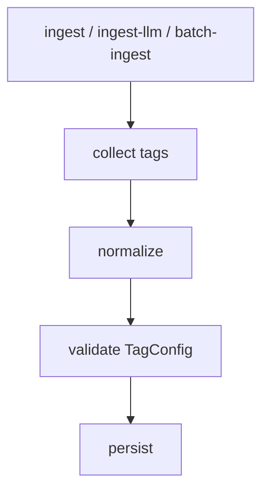

# Design: Schema T2 Tag Governance

## Summary

- Add tag fields with serde defaults and a shared normalization / validation path.

## Data Model / Interfaces

- `tags: Vec<String>` on claim/source/draft models.
- `normalize_tags(...)`
- `validate_tags_against_schema(...)`

## Flow

## Edge Cases

- Old data has no tags.
- LLM emits duplicate or empty tags.
- Existing source tags exceed new limit.
- Deprecated tag appears in imported data.

## Compatibility

- Serde default avoids migration.
- First version should avoid breaking existing batch-ingest unless policy explicitly says error.

## Test Strategy

- Unit: normalization and validation.
- Integration: ingest-llm / batch-ingest paths.
- Manual: inspect vault frontmatter.
