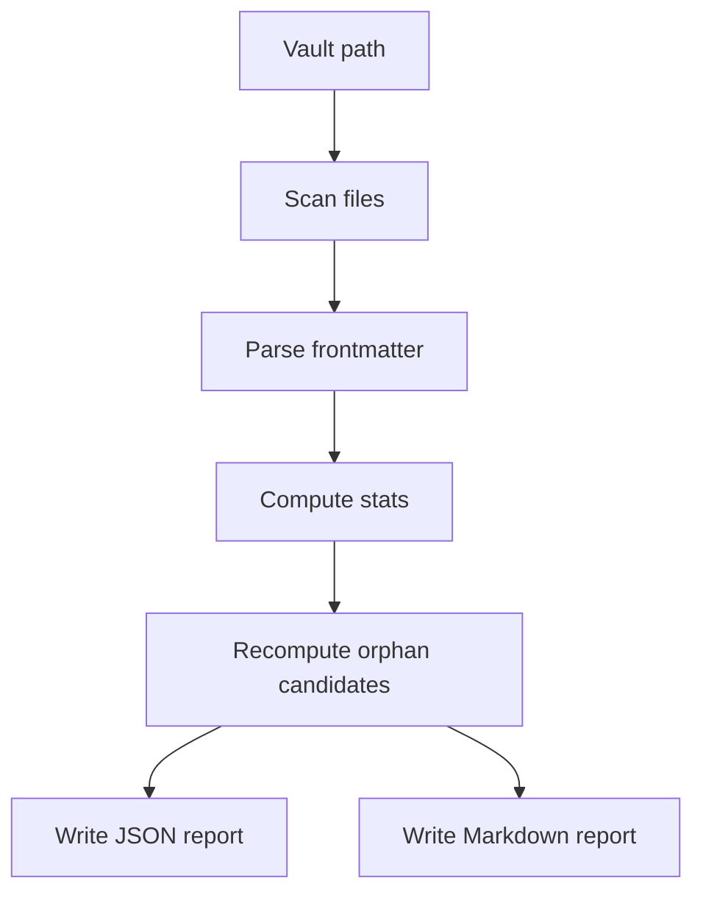

# Design: Vault Audit

## Summary

Add a read-only audit path that scans the vault and emits one structured report
object, rendered as JSON and Markdown.

## Plain-Language Design

- Module role: inspector.
- Data it asks for: vault files and frontmatter.
- Data it returns: counts, warnings, examples, and backfill readiness buckets.

## Data Model / Interfaces

- `VaultAuditReport`
  - vault path, generated time
  - totals
  - source stats
  - page stats
  - stable ID coverage
  - orphan stats
  - warnings and sample paths
- JSON is truth.
- Markdown renders from the same report object.

## Flow

## Edge Cases

- Invalid UTF-8 Markdown.
- Missing frontmatter.
- Unterminated frontmatter.
- Duplicate `notion_uuid`, future `source_id`, or future `page_id`.
- Unsupported page directory or entry type.
- Existing stale `.wiki/orphan-audit.json`.

## Compatibility

- Does not change current ingest/backfill behavior.
- Uses vault-relative report output rules.

## Spec Sync Rules

- If audit needs write behavior, update PRD first.
- If report categories change B2/B5 scope, update those specs first.

## Test Strategy

- Unit: frontmatter parsing, counters, orphan categorization.
- Integration: fixture vault emits JSON and Markdown only.
- Manual: run against `/Users/mac-mini/Documents/wiki` and inspect report.
