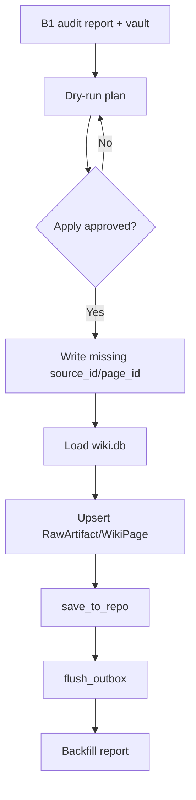

# Design: Vault Backfill

## Summary

Backfill is a two-phase operation:

1. Identity phase: ensure source/page files have stable system IDs.
2. DB phase: import source/page records into vault-local `wiki.db` and flush
   outbox.

## Plain-Language Design

- Module role: importer.
- Data it asks for: audited vault files and target db path.
- Data it returns: stable IDs, imported records, and outbox.

## Data Model / Interfaces

- Source identity:
  - `source_id`: primary system ID for source files.
  - `notion_uuid`: provenance.
  - path: location.
- Page identity:
  - `page_id`: primary system ID for page files.
  - `entry_type`: content type.
- Scope:
  - imported source/page records default to `shared:wiki`.
- Backfill report:
  - planned ID writes
  - planned DB upserts
  - skipped records
  - duplicate/conflict warnings

## Flow

## Edge Cases

- Existing duplicate IDs.
- File has `notion_uuid` but no system ID.
- File moved after ID assignment.
- Apply interrupted after ID writes but before DB writes.
- Apply interrupted after DB writes but before outbox flush.
- Unsupported page type.
- Missing required source metadata.

## Compatibility

- Keeps `batch-ingest` for future `compiled_to_wiki: false` sources.
- Does not change Notion migration fields.
- Does not change projection ownership rules.

## Spec Sync Rules

- If implementation needs source full text in palace by default, update PRD
  first.
- If implementation needs claim inference from Markdown, update PRD first.

## Test Strategy

- Unit: stable ID assignment and duplicate detection.
- Integration: fixture vault dry-run, apply, rerun idempotency, outbox presence.
- Manual: limited backfill before full vault.
