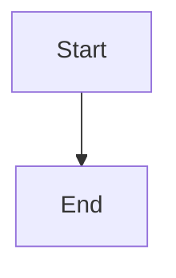

# Design: <Feature>

## Summary

-

## Data Model / Interfaces

-

## Flow

```mermaid
flowchart TD
    A["Start"] --> B["End"]
```

## Edge Cases

-

## Compatibility

-

## Test Strategy

- Unit:
- Integration:
- Manual:
