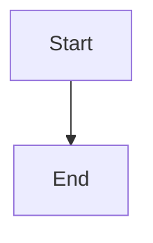

# Design: <Feature>

## Summary

-

## Plain-Language Design

- Module role:
- Data it asks for:
- Data it returns:

## Data Model / Interfaces

-

## Flow

## Edge Cases

-

## Compatibility

-

## Spec Sync Rules

- If implementation needs a different interface, update this file before code.
- If a review changes module boundaries, update flow and tasks before continuing.

## Test Strategy

- Unit:
- Integration:
- Manual:
